# Lab 01 — Conditional Access: MFA policy from scratch

## Objective

Create and enforce a Conditional Access policy requiring MFA for all users, with a break-glass emergency account excluded, following the production-grade rollout process: build → report-only validation → enforcement → testing.

## Environment

| | |
|---|---|
| **Tenant** | DidacIAMLab.onmicrosoft.com |
| **License** | Microsoft Entra ID P2 |
| **Users involved** | DidacSanchez (Global Admin), testpim (test user), breakglass (emergency account) |
| **Date completed** | 28 July 2026 |
| **Time** | ~1.5 hours |

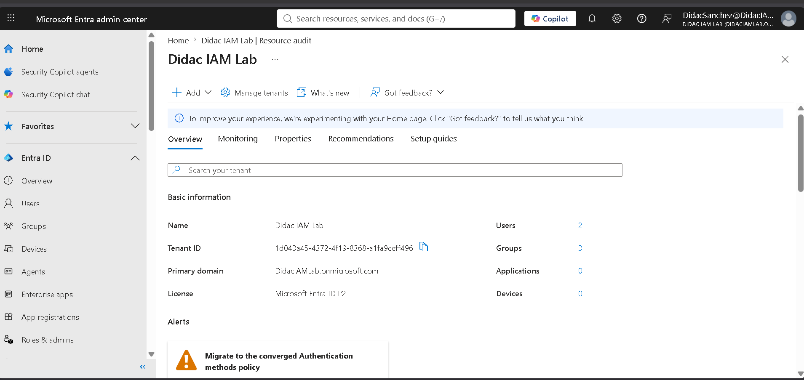

## Step 1 — Break-glass emergency account

Created `breakglass@DidacIAMLab.onmicrosoft.com` with **Global Administrator** assigned as a **permanent active assignment** (not PIM-eligible — an emergency account must never depend on an activation flow that could itself be broken).

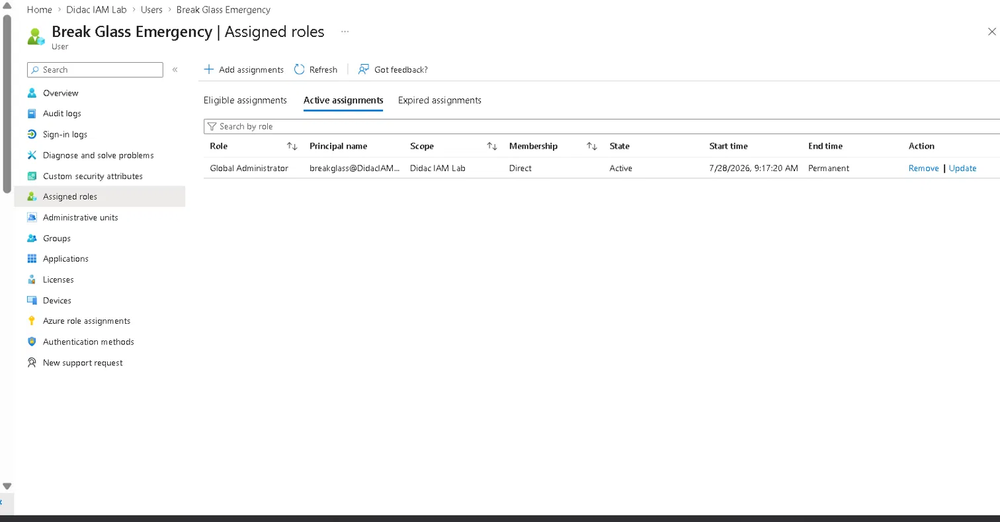
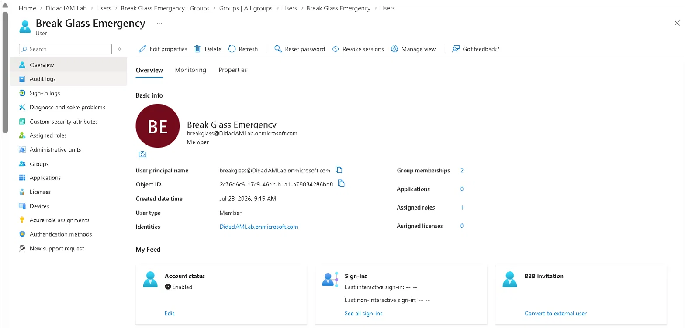

**Why this matters:** a misconfigured CA policy can lock every admin out of the tenant. The break-glass account, excluded from all CA policies, is the guaranteed way back in. Microsoft recommends at least two of these in production, with sign-in alerting on both.

## Step 2 — Security groups

| Group | Type | Members | Purpose |
|-------|------|---------|---------|
| SG-CA-Excluded | Security | breakglass | Excluded from all CA policies |
| SG-AllUsers | Security | testpim | Standard users subject to policies |

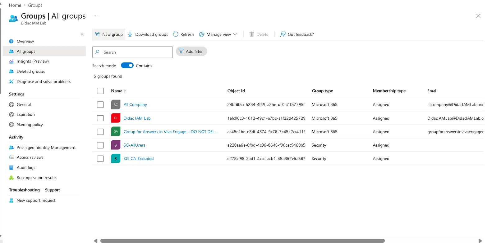

**Design decision:** the policy excludes the *group*, not the individual account. Future emergency accounts only need to be added to SG-CA-Excluded — no policy edits required.

## Step 3 — The Conditional Access policy

**CA-001: Require MFA - All users**

| Setting | Value |
|---------|-------|
| Users — Include | All users |
| Users — Exclude | SG-CA-Excluded + current admin (DidacSanchez) |
| Target resources | All resources (formerly 'All cloud apps') |
| Grant | Require multifactor authentication |
| Initial state | **Report-only** |

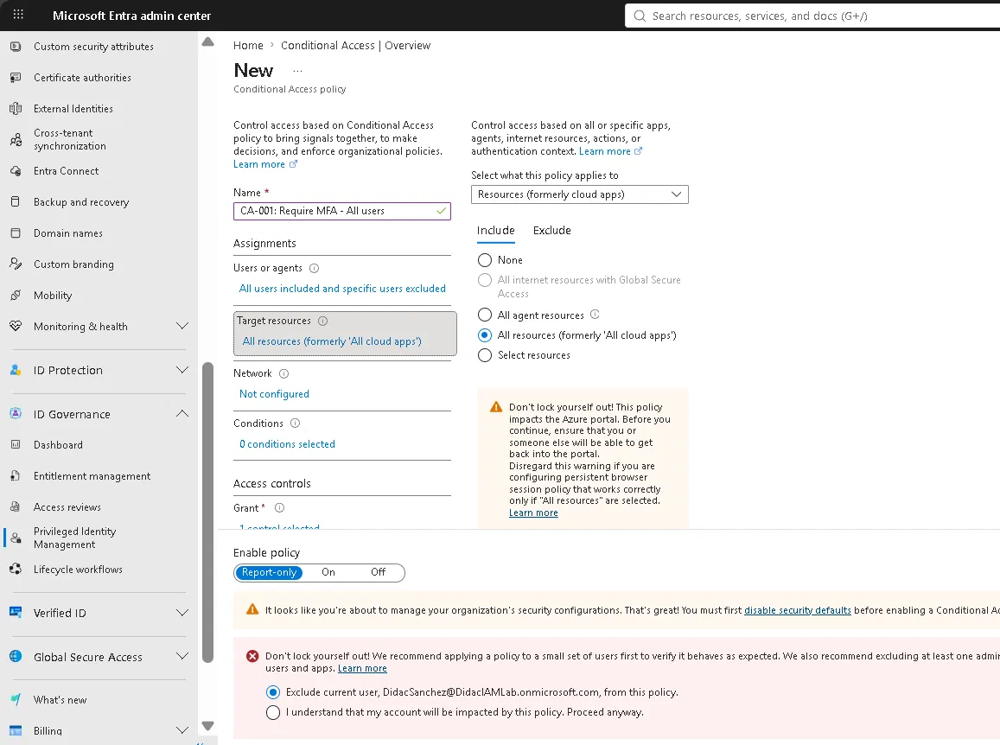
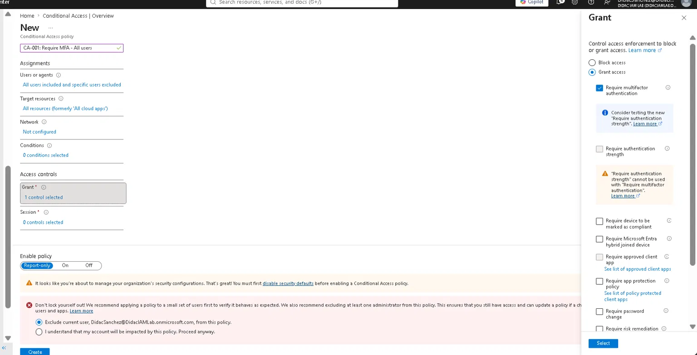

**Design decisions:**
- **Report-only first.** The policy logs what *would* happen without enforcing anything — the standard safe rollout in production.
- **Current admin excluded.** The portal's "Don't lock yourself out" safeguard was accepted: DidacSanchez is excluded alongside the break-glass group, keeping a second guaranteed admin path during rollout.
- **All resources, not selected apps.** Zero Trust principle — verify every access, not just "important" apps.

### Security Defaults migration

The tenant had **Security Defaults** enabled, which blocks Conditional Access. Disabled them via Entra ID → Properties → Manage security defaults, selecting *"My organization is planning to use Conditional Access"* as the reason.

This mirrors the real migration path every organization follows: Security Defaults (baseline, no granularity) → Conditional Access (granular, policy-based). Note: deactivation takes a few minutes to propagate — breakglass briefly saw a leftover Security Defaults MFA registration prompt after disabling.

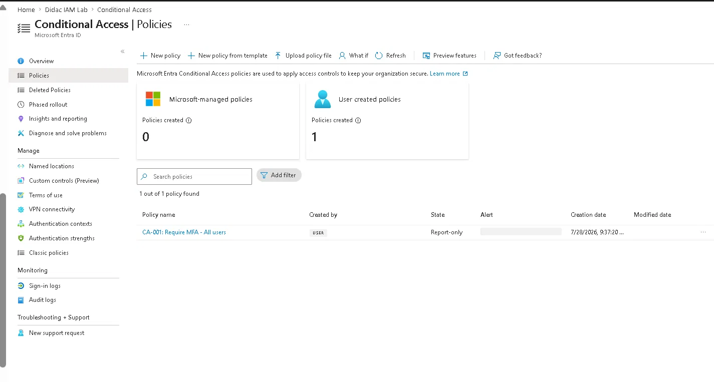

## Step 4 — Report-only validation

Signed in as `testpim` from an incognito session, then checked **Sign-in logs → Report-only** tab for that sign-in:

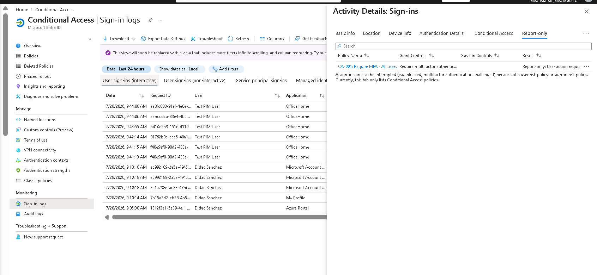

Result: `CA-001` evaluated with **"Report-only: User action required"** — meaning the policy *would have* demanded MFA. Exactly the expected outcome.

**Interesting detail from the logs:** two earlier failed sign-ins (error 50126 — wrong password) show *"Conditional Access: Not Applied"*. CA is only evaluated **after** credentials succeed — it's an access control layer, not an authentication layer.

## Step 5 — Enforcement

Switched CA-001 from Report-only to **On**.

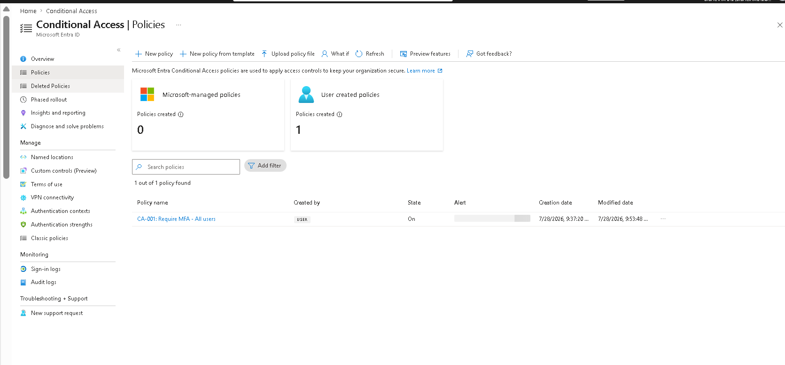

## Step 6 — End-to-end testing

**Test A — standard user (testpim):** sign-in now triggers MFA with number matching via Microsoft Authenticator:

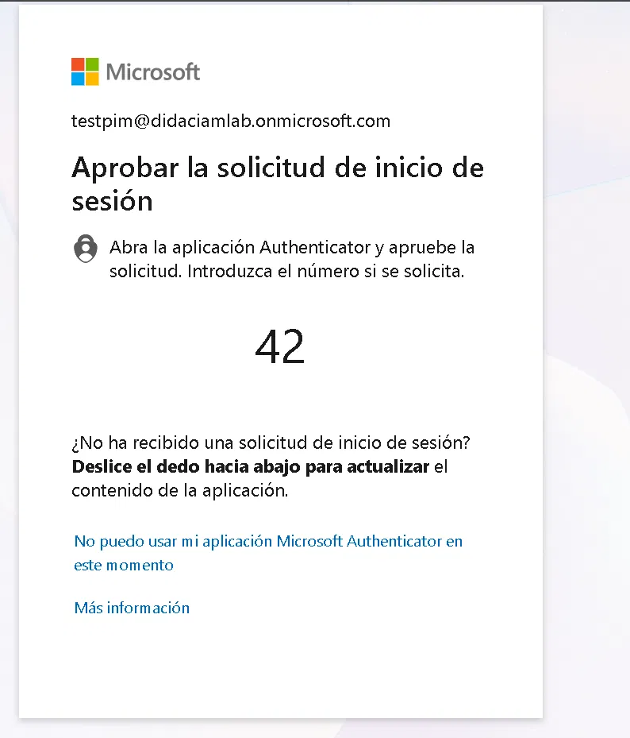

**Test B — break-glass account:** signs in directly, no MFA challenge — the group exclusion works:

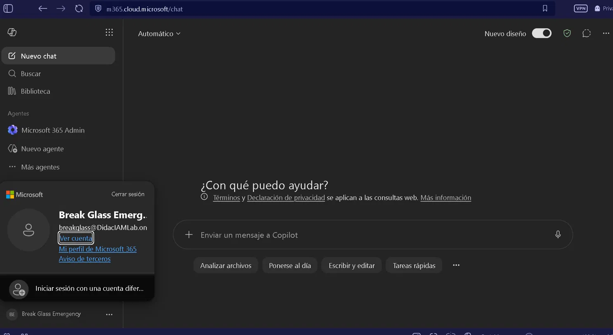

| Account | Expected | Result |
|---------|----------|--------|
| testpim | MFA required | ✅ MFA prompt with number matching |
| breakglass | No MFA | ✅ Direct access |

## Lessons learned

1. **Create the break-glass account before touching any policy.** The portal itself warns "Don't lock yourself out" — in a tenant with one admin, that's not theoretical.
2. **Report-only mode is the professional difference.** Jumping straight to On works in a lab but is how outages happen in production.
3. **Security Defaults and Conditional Access are mutually exclusive** — the migration between them is a real task in every org adopting CA, and propagation isn't instant.
4. **CA evaluates after authentication.** Failed-password sign-ins never reach policy evaluation — visible directly in the logs.
5. **Exclude groups, not users.** Membership changes shouldn't require policy edits.

## Key concepts for SC-300

- Conditional Access = Zero Trust policy engine (signals → decision → enforcement)
- Requires Entra ID P1; report-only state; number matching MFA
- Break-glass / emergency access account best practices
- Security Defaults vs Conditional Access migration

---
*Tenant: DidacIAMLab.onmicrosoft.com · Completed 28 July 2026*
