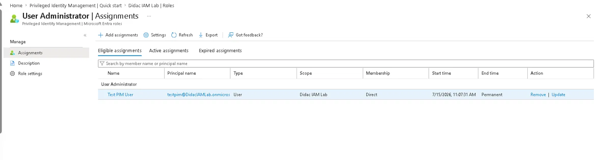
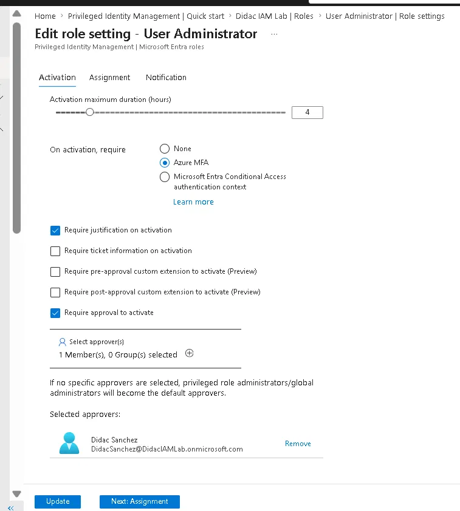
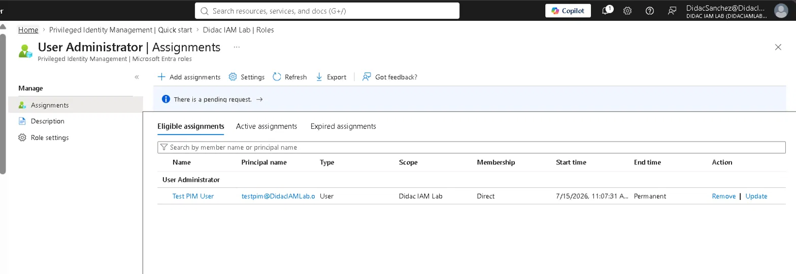
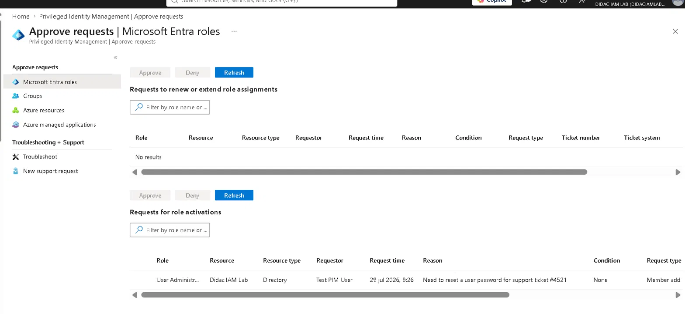
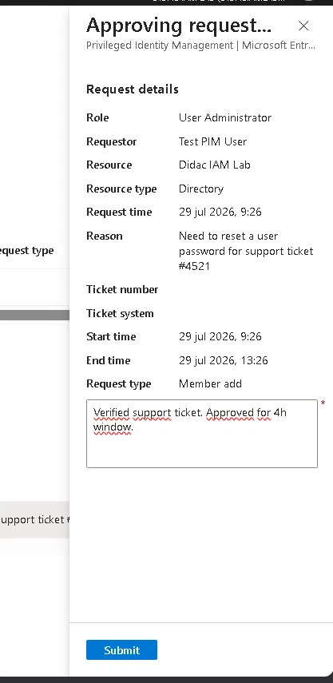
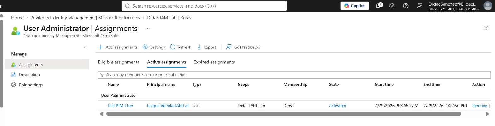
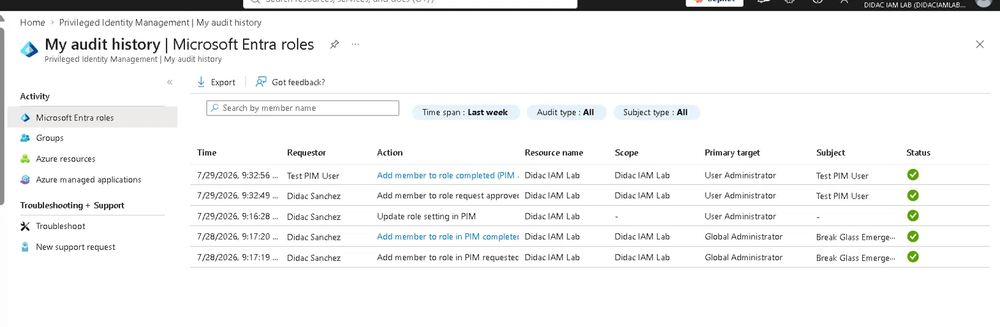

# Lab 02 — Privileged Identity Management (PIM)

## Objective

Implement just-in-time privileged access with PIM: replace a standing role assignment with an eligible one, gate activation behind MFA + justification + approval, and verify the full lifecycle — request, approval, time-boxed activation and audit trail.

## Environment

| | |
|---|---|
| **Tenant** | DidacIAMLab.onmicrosoft.com |
| **License** | Microsoft Entra ID P2 (PIM requires P2) |
| **Role used** | User Administrator |
| **Requestor** | testpim (eligible user) |
| **Approver** | DidacSanchez (Global Admin) |
| **Not involved** | breakglass — emergency accounts must keep permanent active assignments, never PIM |
| **Date completed** | 29 July 2026 |
| **Time** | ~1.5 hours |

## The core idea

| | Active assignment | Eligible assignment |
|---|---|---|
| Privileges | Always on | Only when activated |
| Risk window | Permanent | Time-boxed (4h here) |
| Audit story | "Has the role" | Who, when, why, approved by whom |

Instead of testpim *having* User Administrator forever, testpim *can request it* — with justification, MFA and approval — and it expires on its own.

```
testpim requests → justification + MFA → approver reviews → active 4h → auto-expires → full audit trail
```

## Step 1 — Eligible assignment

`testpim` holds **User Administrator** as **Eligible · Permanent** — meaning he can always *request* the role, but never *has* it by default. Confirmed in the tenant: the account shows **"No roles assigned"** when signed in without an activation.



**Role choice:** User Administrator is realistic for a support technician (password resets, user management) without the blast radius of Global Administrator.

## Step 2 — Role settings (the rules of activation)

PIM → Microsoft Entra roles → User Administrator → Role settings:

| Setting | Value | Why |
|---------|-------|-----|
| Activation maximum duration | 4 hours | Covers a real admin task without leaving privileges hanging |
| On activation, require | Azure MFA | Identity re-verified at the exact moment of privilege escalation |
| Require justification | Yes | Auditors need the *why*, not just the *who* |
| Require approval | Yes | Human control point before privileges exist |
| Approver | DidacSanchez | Explicit approver instead of "any Global Admin" default |



## Step 3 — Activation request (as testpim)

Signed in as `testpim` → PIM → **My roles** → Eligible assignments → User Administrator → **Activate**:

- Justification: *"Need to reset a user password for support ticket #4521"*
- Duration: 4h

**Troubleshooting note (real):** the portal returned *"Activate role failed — Unknown error"* on submit. The request had actually gone through — confirmed seconds later by the "There is a pending request" banner on the admin side. Lesson: with PIM, verify the actual state before retrying; portal errors aren't always real failures. (Also worth knowing: role-setting changes can take a few minutes to propagate before activations behave.)



## Step 4 — Approval (as DidacSanchez)

PIM → **Approve requests** → the activation request appears under "Requests for role activations" with role, requestor, request time and full justification:



Approved with justification: *"Verified support ticket. Approved for 4h window."* — the approval panel shows the complete request context including the exact activation window before submitting:



## Step 5 — Verification

**Active assignment:** testpim now appears in *both* tabs — Eligible (permanent, can always request) and **Active: State "Activated", 9:32:50 AM → 1:32:50 PM**. Exactly 4 hours, then it disappears on its own.



**Audit trail** — the entire lifecycle is recorded, readable as a story:

```
9:16:28  Didac Sanchez   Update role setting in PIM
9:32:49  Didac Sanchez   Add member to role request approved
9:32:56  Test PIM User   Add member to role completed (PIM activation)
```

The log also still shows the 28 July entries from Lab 01 — the break-glass Global Administrator assignment — both labs leaving their trace in the same audit history:



## Lessons learned

1. **"No roles assigned" is the goal state.** A PIM-managed user carries zero standing privileges — the eligible assignment is invisible until activated.
2. **Portal errors ≠ real failures.** The "Unknown error" on activation was cosmetic; the request existed. Check actual state (pending requests, audit log) before retrying.
3. **Emergency accounts are the explicit exception.** breakglass keeps a permanent active assignment on purpose — an emergency path must not depend on an approval flow that could itself be down.
4. **The audit log is the product.** Duration, MFA, justification and approval all exist to produce that readable chain of who/when/why — that's what compliance teams actually consume.
5. **Labs compound:** the CA-001 policy from Lab 01 challenged testpim with MFA during this lab's sign-ins, and both labs share one audit history.

## Key concepts for SC-300

- PIM requires Entra ID P2
- Eligible vs Active assignments; permanent vs time-bound
- Just-in-time (JIT) access vs standing privileges
- Activation settings: max duration, MFA on activation, justification, approval workflow
- PIM audit history / resource audit as the compliance record

---
*Tenant: DidacIAMLab.onmicrosoft.com · Completed 29 July 2026*
