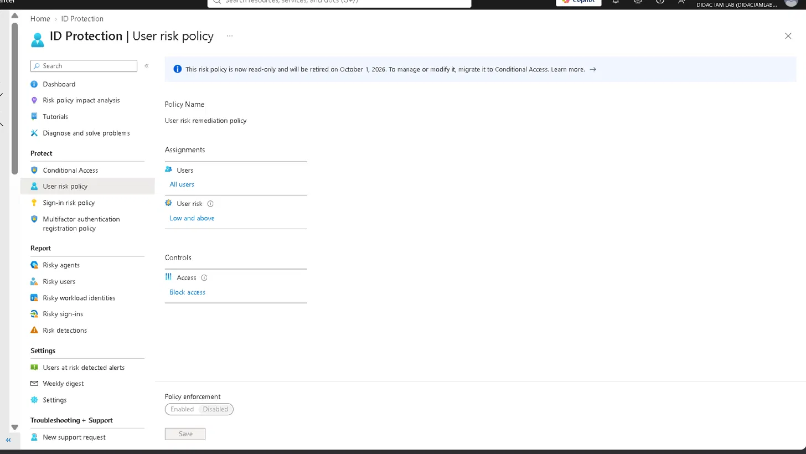
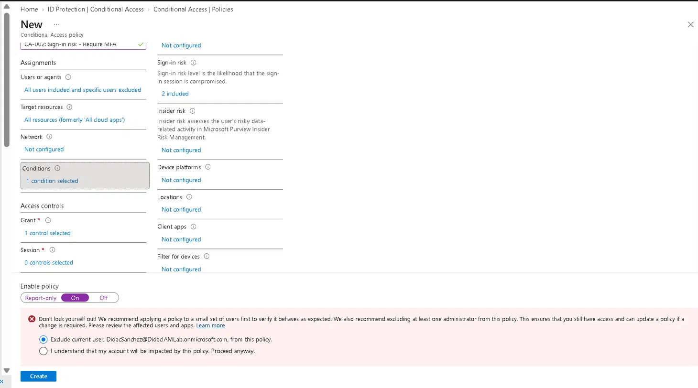
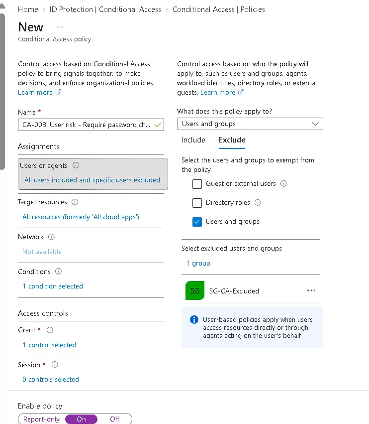
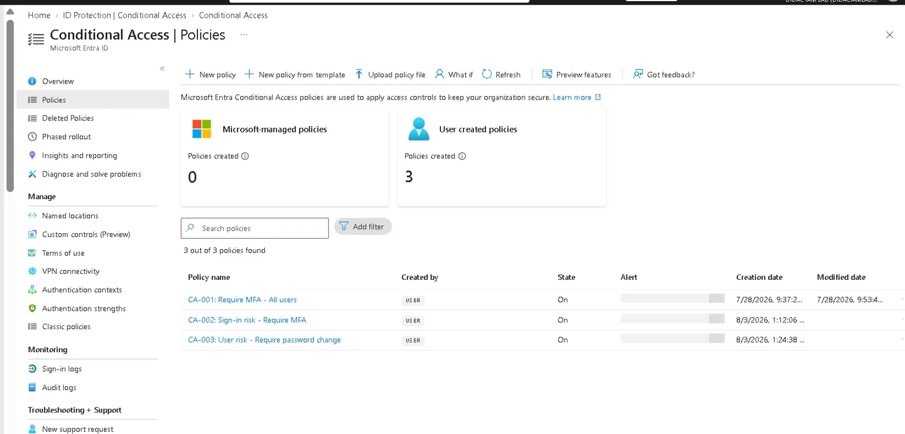
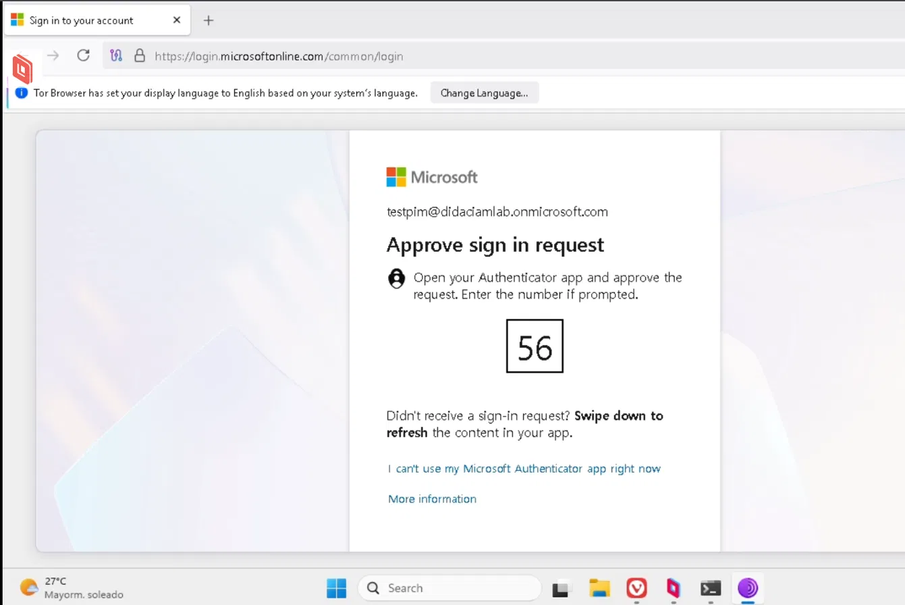
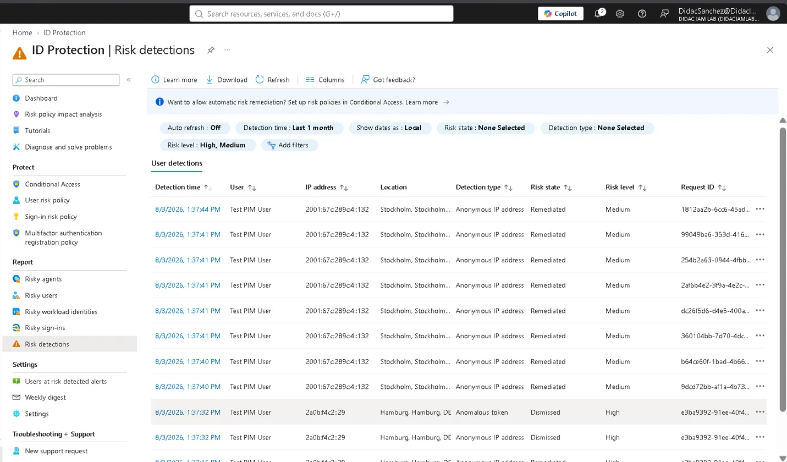
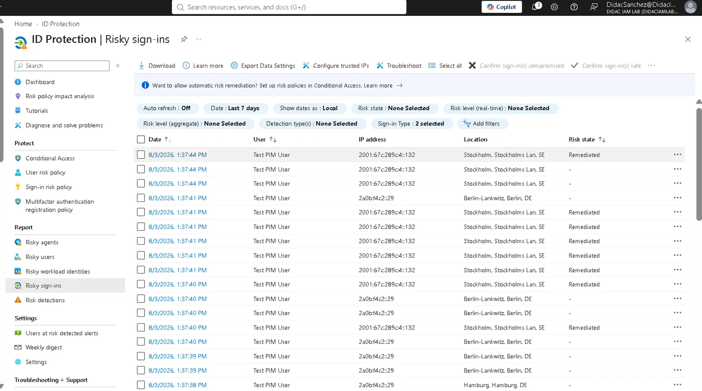
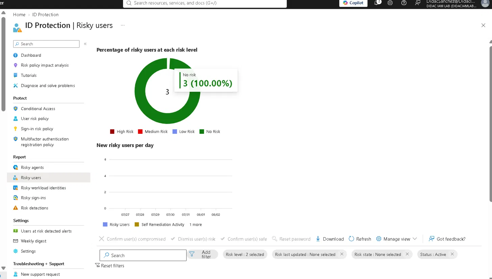

# Lab 03 — Identity Protection & risky sign-ins

## Objective

Configure Identity Protection risk policies to automatically detect and respond to suspicious sign-ins and compromised accounts. Simulate a real risky sign-in using Tor Browser (anonymous IP) and verify the full detection → remediation → reporting cycle.

## Environment

| | |
|---|---|
| **Tenant** | DidacIAMLab.onmicrosoft.com |
| **License** | Microsoft Entra ID P2 (Identity Protection requires P2) |
| **Attacker tool** | Tor Browser (anonymous IP) |
| **Target user** | testpim |
| **Admin** | DidacSanchez |
| **Date completed** | 3 August 2026 |
| **Time** | ~1.5 hours |

## Key discovery: risk policies migrated to Conditional Access

When opening Identity Protection → User risk policy, the portal showed:

> *"This risk policy is now read-only and will be retired on October 1, 2026. To manage or modify it, migrate it to Conditional Access."*

Microsoft is migrating risk policies from Identity Protection's built-in policies to **Conditional Access** — the modern approach. Identity Protection still **detects** risk; Conditional Access now **responds** to it. This is the method that current SC-300 exams test and what production environments should use.

## Step 1 — Sign-in risk policy (CA-002)

Created via Conditional Access (not the legacy Identity Protection policy):

**CA-002: Sign-in risk - Require MFA**

| Setting | Value |
|---------|-------|
| Users — Include | All users |
| Users — Exclude | SG-CA-Excluded + DidacSanchez |
| Target resources | All resources |
| Conditions → Sign-in risk | Medium + High |
| Grant | Require multifactor authentication |
| State | **On** |

**When does this fire?** When Identity Protection detects a sign-in with medium or high risk (anonymous IP, atypical travel, malware-linked IP), CA-002 forces MFA before granting access.

## Step 2 — User risk policy (CA-003)

**CA-003: User risk - Require password change**

| Setting | Value |
|---------|-------|
| Users — Include | All users |
| Users — Exclude | SG-CA-Excluded |
| Target resources | All resources |
| Conditions → User risk | Medium + High |
| Grant | Require password change |
| State | **On** |

**Different action, different risk type.** Sign-in risk = "this login looks suspicious" → MFA verifies identity. User risk = "this account may be compromised" → password change eliminates the compromised credential.

## Step 3 — Policy architecture

Three CA policies now active, each covering a different security layer:

| Policy | Trigger | Action | Layer |
|--------|---------|--------|-------|
| CA-001 | Every sign-in | Require MFA | Baseline Zero Trust |
| CA-002 | Sign-in risk Medium+ | Require MFA | Threat response |
| CA-003 | User risk Medium+ | Require password change | Compromise response |

This layered approach is exactly what Microsoft recommends for production environments — and what SC-300 tests as "defense in depth" for identity.

## Step 4 — Simulating a risky sign-in with Tor Browser

Downloaded Tor Browser (torproject.org) and signed in as `testpim@DidacIAMLab.onmicrosoft.com` from an anonymous IP address. Tor routes traffic through multiple nodes, making the sign-in appear from Stockholm, Berlin and Hamburg simultaneously.

**Result:** CA-002 immediately challenged the sign-in with MFA (number matching via Microsoft Authenticator):

After approving MFA, the sign-in succeeded — but Identity Protection recorded everything.

## Step 5 — Risk detections

Identity Protection → Risk detections shows the full detection timeline:

| Detection type | Location | Risk level | State |
|---|---|---|---|
| Anonymous IP address | Stockholm, SE | Medium | Remediated |
| Anonymous IP address | Berlin, DE | Medium | Remediated |
| Anomalous token | Hamburg, DE | High | Dismissed |

**"Remediated"** means the CA policy required action (MFA) and the user completed it. The risk was detected and handled automatically — zero manual intervention needed.

Multiple detections from a single Tor session: each exit node generated a separate detection, and the "Anomalous token" fired because the token was issued from one location and used from another — exactly the pattern of a stolen session token in a real attack.

## Step 6 — Risky sign-ins report

Identity Protection → Risky sign-ins shows every flagged sign-in across multiple Tor exit nodes (Stockholm, Berlin, Hamburg) — all within a 6-second window:

## Step 7 — Risky users report

Identity Protection → Risky users shows all 3 tenant users at **"No risk" (100%)** — the policies successfully remediated every detection:

The graph shows risk activity spikes on the days labs were performed (28 July – 3 August), with all risks resolved through policy-driven remediation.

## Lessons learned

1. **Identity Protection detects; Conditional Access responds.** The legacy risk policies inside Identity Protection are being retired (October 2026). The modern approach — and what SC-300 tests — is risk-based Conditional Access policies.
2. **Tor Browser is the easiest way to trigger risk detections in a lab.** A single session through Tor generated 10+ detections across multiple exit nodes — Anonymous IP, Anomalous token, and multiple locations.
3. **"Remediated" is the goal state.** It means the system detected the risk and the user satisfied the remediation (MFA or password change) without admin intervention. Automated remediation at scale.
4. **Layered policies compound.** CA-001 (baseline MFA) + CA-002 (sign-in risk) + CA-003 (user risk) = defense in depth for identity. Each layer catches what the previous one might miss.
5. **Labs compound across the series.** The MFA configuration from Lab 01 and the Authenticator setup from Lab 02 made this lab possible — testpim could satisfy the MFA challenge because MFA was already configured.

## Key concepts for SC-300

- Identity Protection requires Entra ID P2
- Sign-in risk vs User risk — different signals, different remediations
- Risk-based Conditional Access policies (modern) vs legacy Identity Protection policies (retiring Oct 2026)
- Risk levels: Low, Medium, High
- Risk states: At risk, Remediated, Dismissed, Confirmed compromised
- Detection types: Anonymous IP, Atypical travel, Anomalous token, Leaked credentials, Malware-linked IP

---
*Tenant: DidacIAMLab.onmicrosoft.com · Completed 3 August 2026*
