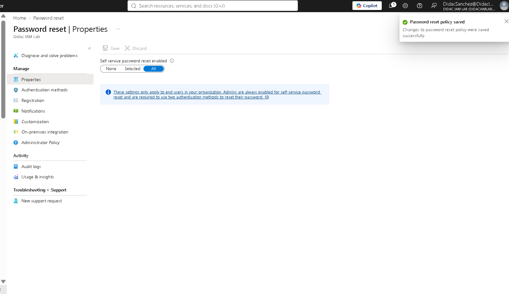
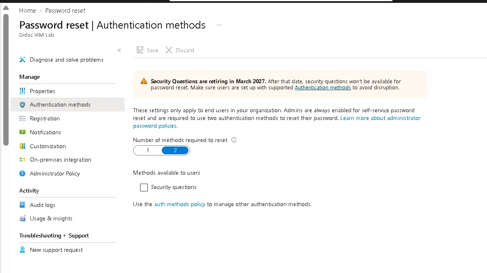
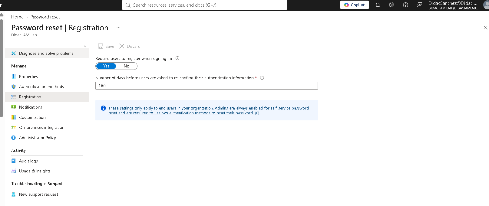
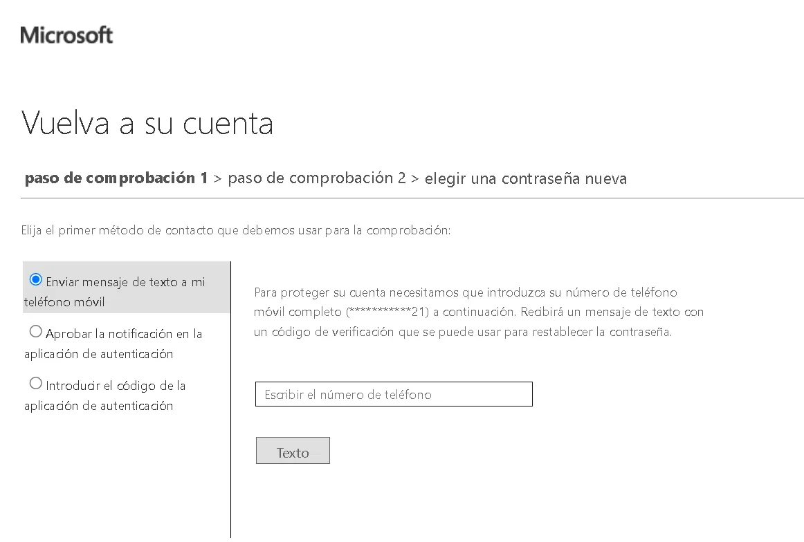
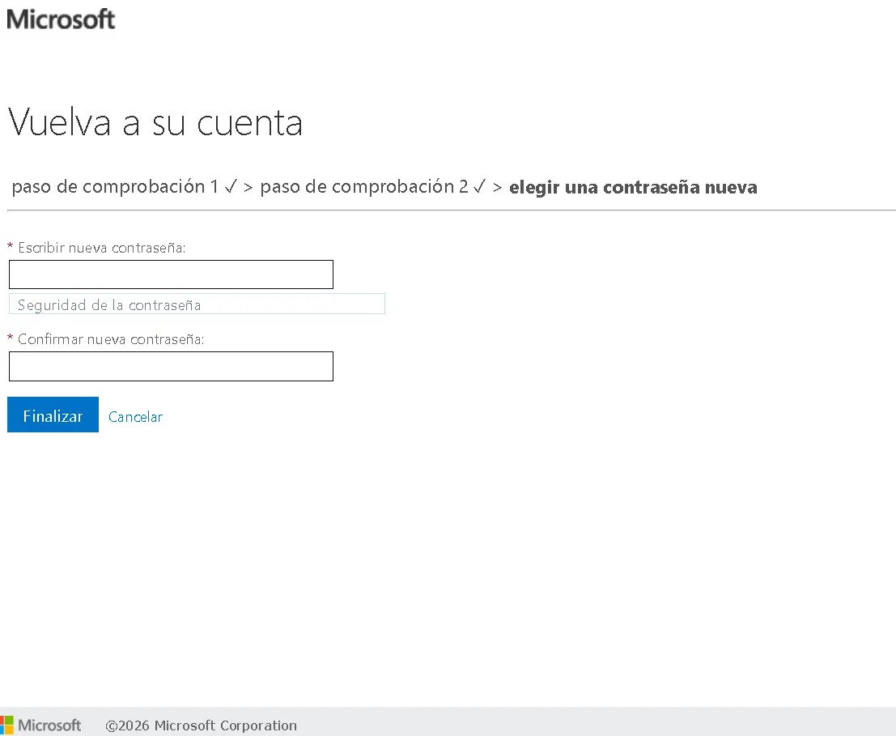
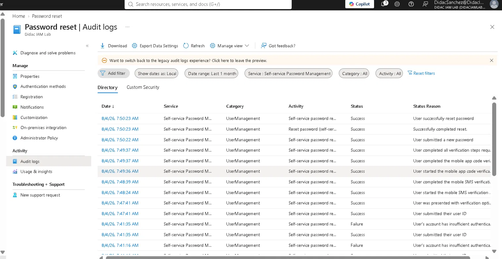

# Lab 04 — SSPR & authentication methods

## Objective

Enable Self-Service Password Reset so users can reset their own passwords without calling helpdesk, verify the end-to-end user flow with two authentication methods, and document the troubleshooting of a real configuration issue (SMS disabled by policy).

## Environment

| | |
|---|---|
| **Tenant** | DidacIAMLab.onmicrosoft.com |
| **License** | Microsoft Entra ID P1+ (SSPR for groups requires P1; tenant has P2) |
| **User** | testpim (simulates a locked-out employee) |
| **Admin** | DidacSanchez |
| **Date completed** | 4 August 2026 |
| **Time** | ~1 hour |

## Why this matters

Password resets are the #1 helpdesk ticket in enterprise IT. At SEIDOR, this accounts for a significant portion of the 15–30 weekly incidents. SSPR eliminates most of those calls — users verify their identity with two registered methods and reset their own password in under 2 minutes. The ROI is immediate and measurable.

## Step 1 — Enable SSPR

Password reset → Properties: changed from **None** to **All**.



**Design decision:** "All" instead of "Selected" because in a lab tenant there's no reason to scope to a group. In production, rolling out to a pilot group first (via "Selected") is the safe approach — same report-only philosophy from Lab 01.

## Step 2 — Authentication methods configuration

Password reset → Authentication methods:

| Setting | Value |
|---------|-------|
| Methods required to reset | **2** |
| Methods available | Mobile phone (SMS), Mobile app notification, Mobile app code |



**Why 2 methods:** one method is insecure (if a phone is stolen, the attacker resets the password). Three is too much friction for users. Two is the security-usability sweet spot that Microsoft recommends.

**Migration note:** the legacy per-feature method configuration (inside Password reset) now redirects to the centralized **Authentication methods policy** (Entra ID → Protection → Authentication methods). This is the same consolidation pattern seen in Lab 03 with Identity Protection risk policies moving to Conditional Access — Microsoft is centralizing all identity controls.

## Step 3 — Troubleshooting: "insufficient authentication methods"

The first SSPR attempt failed with: *"Your organization has not properly set up password reset."*



**Root cause:** testpim had Microsoft Authenticator registered but Phone (SMS) was **"Disabled by policy"** in the centralized Authentication methods policy. Only 1 usable method, but SSPR requires 2.

**Fix:** Entra ID → Protection → Authentication methods → Policies → SMS → **Enable: Yes** → Target: All users → Save.

**Lesson for production:** enabling SSPR in Password reset Properties is not enough — the authentication methods that SSPR depends on must also be enabled in the **tenant-wide Authentication methods policy**. Two different configuration planes that must agree. This is a real deployment gotcha that catches many admins.

## Step 4 — Successful SSPR flow

After enabling SMS, the complete self-service flow worked:

**Step 1 — Identity verification (method 1: SMS):**



The user chose from three options: SMS to mobile, Authenticator notification, or Authenticator code. Selected SMS → received verification code → entered it.

**Step 2 — Identity verification (method 2: Authenticator):**

Second verification completed via Microsoft Authenticator app code.

**Step 3 — New password:**

Both verification steps passed (✓ ✓), user set a new password:



## Step 5 — Audit trail

Password reset → Audit logs shows the complete SSPR lifecycle, including the earlier failures:



The audit reads as a story:

```
7:41 AM  Failure  "User's account has insufficient authentication methods"
7:41 AM  Success  "User submitted their user ID" (second attempt after SMS enabled)
7:47 AM  Success  "User submitted their user ID"
7:48 AM  Success  "User started the mobile SMS verification"
7:48 AM  Success  "User completed the mobile SMS verification"
7:49 AM  Success  "User started the mobile app code verification"
7:49 AM  Success  "User completed the mobile app code verification"
7:49 AM  Success  "User completed all verification steps required"
7:50 AM  Success  "User submitted a new password"
7:50 AM  Success  "User successfully reset password"
```

The failure entries are valuable — they document the real troubleshooting process and prove the fix worked.

## Lessons learned

1. **SSPR has two configuration planes.** Enabling it in Password reset Properties is necessary but not sufficient — the authentication methods it relies on must also be enabled in the centralized Authentication methods policy. This mismatch is the most common SSPR deployment failure.
2. **Two methods is the right default.** One is insecure, three creates friction that pushes users back to calling helpdesk — defeating the purpose.
3. **The audit log captures everything**, including failed attempts. In production, the "insufficient authentication methods" failures would signal that SSPR was deployed before users registered enough methods — a rollout sequencing problem.
4. **SSPR directly reduces helpdesk load.** Each successful self-service reset is a ticket that never gets created. At 15–30 password incidents per week, even 50% SSPR adoption cuts ticket volume significantly.
5. **Microsoft is centralizing identity controls.** Per-feature settings (SSPR methods, Identity Protection risk policies) are migrating to centralized policies (Authentication methods, Conditional Access). Labs 03 and 04 both documented this transition — it's a tenant-wide architectural shift worth understanding.

## Key concepts for SC-300

- SSPR requires Entra ID P1 for group-scoped, available to all with P2
- Number of methods: 1 vs 2 (security trade-off)
- Combined MFA + SSPR registration (modern default)
- Authentication methods policy (centralized) vs per-feature settings (legacy)
- On-premises password writeback requires Entra Connect (not covered in this lab — cloud-only tenant)
- SSPR audit logs and usage reports for monitoring adoption

---
*Tenant: DidacIAMLab.onmicrosoft.com · Completed 4 August 2026*
