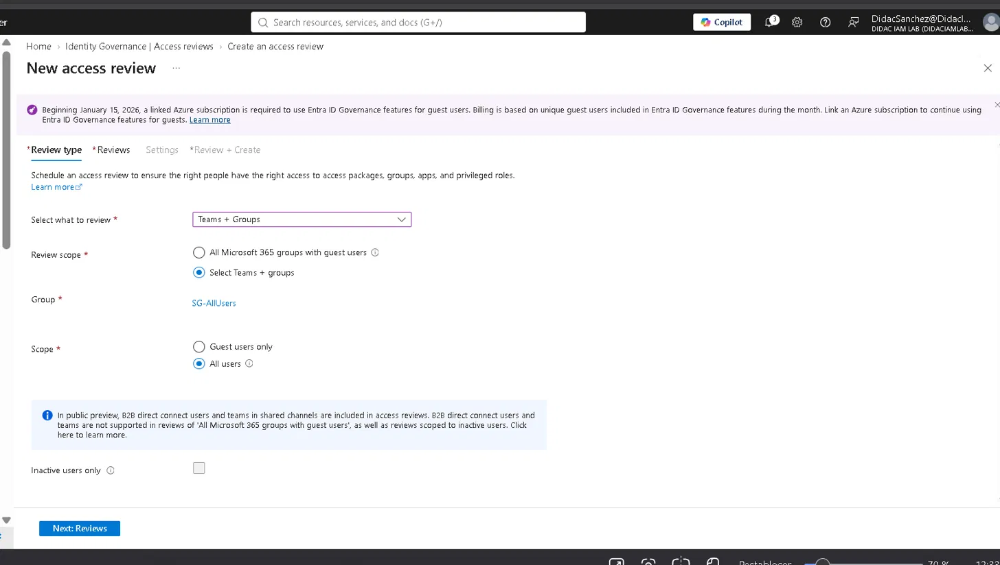
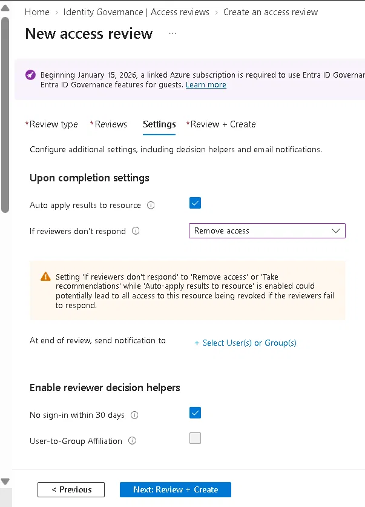
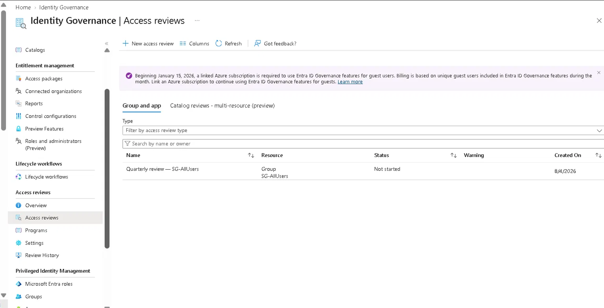
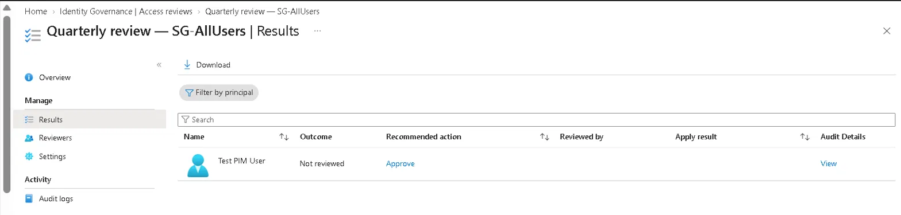
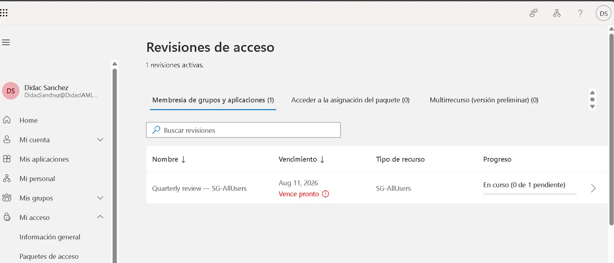
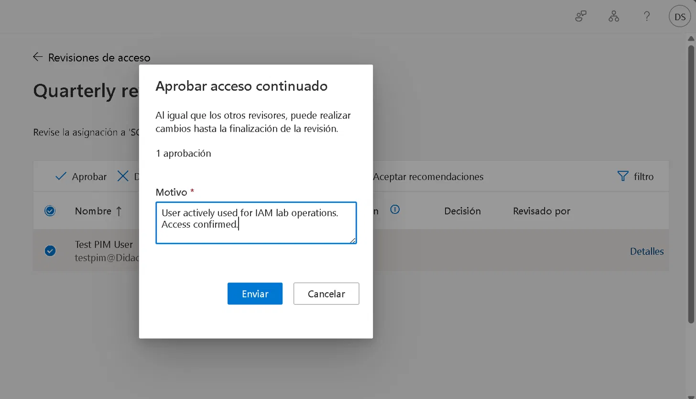

# Lab 05 — Access Reviews & entitlement management

## Objective

Configure a periodic access review to verify that users in a security group still need their membership, complete the review cycle as a designated reviewer, and document the governance workflow that prevents "access sprawl" — the accumulation of unnecessary permissions over time.

## Environment

| | |
|---|---|
| **Tenant** | DidacIAMLab.onmicrosoft.com |
| **License** | Microsoft Entra ID P2 (Access Reviews requires P2) |
| **Group reviewed** | SG-AllUsers |
| **Reviewer** | DidacSanchez (Global Admin) |
| **Date completed** | 4 August 2026 |
| **Time** | ~1 hour |

## Why this matters

Access Reviews answer the compliance question every auditor asks: **"Who has access, and can you prove they still need it?"** Without reviews, group memberships grow indefinitely as people change roles or leave — the classic access sprawl problem. Automated periodic reviews with auto-apply solve this at scale, without manual spreadsheet tracking.

## Step 1 — Create the access review

Identity Governance → Access reviews → New access review:

**Review type tab:**

| Setting | Value |
|---------|-------|
| What to review | Teams + Groups |
| Review scope | SG-AllUsers (specific group) |
| Scope | All users |

**Reviews tab:**

| Setting | Value |
|---------|-------|
| Select reviewers | Specific users → Didac Sanchez |
| Duration | 7 days |
| Review recurrence | One time |
| Start date | 4/8/2026 |

**Settings tab:**

| Setting | Value | Why |
|---------|-------|-----|
| Auto apply results | **Yes** | No manual step needed — decisions apply automatically at the end |
| If reviewers don't respond | **Remove access** | Silence = revocation. The secure default — access is a privilege, not a right |
| Decision helper: No sign-in within 30 days | **Yes** | System flags inactive users automatically, giving the reviewer data to act on |

**Design decision:** "Remove access if no response" is the secure default in production. It means a reviewer who forgets to act doesn't accidentally approve access by inaction. Paired with auto-apply, this creates a fully automated fallback.

## Step 2 — Review created

The review appears in the Access reviews list with status "Not started", scoped to SG-AllUsers, period 4/8/2026–11/8/2026:

## Step 3 — Reviewer dashboard (admin view)

Identity Governance → Access reviews → Results shows the pending decision for Test PIM User:

| Field | Value |
|-------|-------|
| Outcome | Not reviewed |
| Recommended action | **Approve** |
| System justification | Last signed in less than 30 days ago (8/3/2026) |

The decision helper worked: the system automatically recommended Approve because testpim signed in yesterday (last active 8/3/2026). In production, this reduces reviewer cognitive load — inactive users are flagged, active ones are pre-approved.

**Review overview — progress dashboard:**

## Step 4 — Completing the review (reviewer experience)

The review propagated to the reviewer's portal after a short delay (myaccess.microsoft.com — Access reviews):

The reviewer (DidacSanchez) approved Test PIM User with justification:
*"User actively used for IAM lab operations. Access confirmed."*

## Step 5 — What happens next (automated lifecycle)

With auto-apply enabled, when the review period ends (11/8/2026):
- Approved users → **membership maintained automatically**
- Denied users → **removed from group automatically**
- Non-reviewed users → **removed from group** (because "If no response = Remove access")

Zero admin intervention required. This is identity governance at scale.

## Lessons learned

1. **"Remove access if no response" is the only secure default.** Reviewers miss deadlines. If silence meant "keep access", every forgotten review would be a compliance failure. Silence should always revoke.
2. **Decision helpers turn reviews into signal-based decisions.** Instead of a reviewer guessing, the system surfaces last sign-in date — making Approve/Deny a data-driven action.
3. **Access reviews close the identity lifecycle loop.** Labs 01-04 covered creating and protecting access. Lab 05 covers *verifying* access periodically. Together, they form a complete IAM lifecycle: provision → protect → detect → self-service → review.
4. **Propagation delay is real in trial tenants.** The reviewer portal (myaccess.microsoft.com) showed the review only after ~15 minutes. In production, this is near-instant with properly licensed users.
5. **This is what governance means in IAM.** Anyone can set up MFA. Access reviews prove you understand identity as an ongoing responsibility, not a one-time configuration.

## Key concepts for SC-300

- Access Reviews require Entra ID P2
- Review scope: groups, applications, Entra roles, Azure resource roles
- Auto-apply results vs manual apply
- "If reviewers don't respond" — the compliance default
- Decision helpers: last sign-in, group affiliation
- Access review history and audit logs
- Access packages and entitlement management (next-level governance — separate feature)

---
*Tenant: DidacIAMLab.onmicrosoft.com · Completed 4 August 2026*
