# Lab 06 — Access Packages (Entitlement Management)

## Objective

Configure an end-to-end entitlement management workflow using Microsoft Entra ID Access Packages. Show how users can request access to resources themselves through a governed catalog, with approval, automatic provisioning, and time-bound expiration, so IT doesn't have to grant every permission by hand.

**Zero Trust principle applied:** Verify explicitly + Least privilege access. Users get only the access they ask for, only for the time they need it, through an approval chain that leaves a record.

---

## Environment

| Component | Value |
|---|---|
| Tenant | DidacIAMLab.onmicrosoft.com |
| License | Microsoft Entra ID P2 (trial) |
| Admin account | DidacSanchez@DidacIAMLab.onmicrosoft.com |
| Test user | testpim@DidacIAMLab.onmicrosoft.com |
| Portal | entra.microsoft.com / myaccess.microsoft.com |

---

## What Was Built

| Component | Name | Purpose |
|---|---|---|
| Resource group | SG-Finance-App-Access | Security group representing a finance application resource |
| Catalog | IAM-Lab-Catalog | Container for access packages and their resources |
| Access Package | AP-Finance-Access | Requestable bundle of access to finance resources |
| Policy | Initial Policy | Defines who can request, the approval flow, and expiration |

---

## Steps

### 1. Create resource group

Created security group `SG-Finance-App-Access` (Assigned membership, no initial members) to act as the resource governed by the access package.

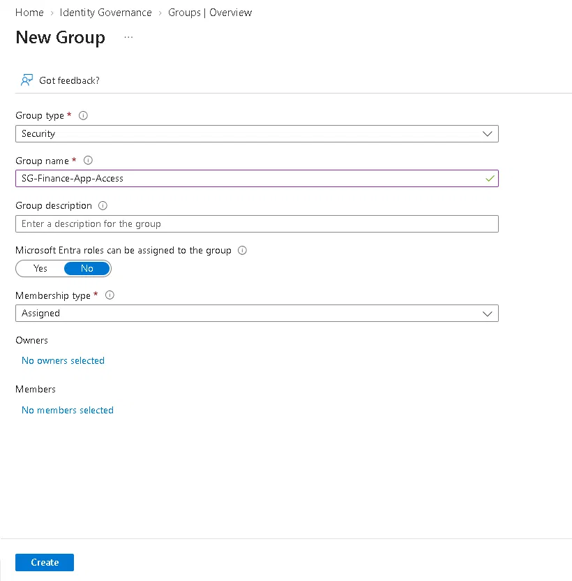

---

### 2. Create catalog

Created `IAM-Lab-Catalog` under Identity Governance → Entitlement management → Catalogs.

- Enabled for users to request: **Yes**
- Enabled for external users: **No** (internal tenant only)

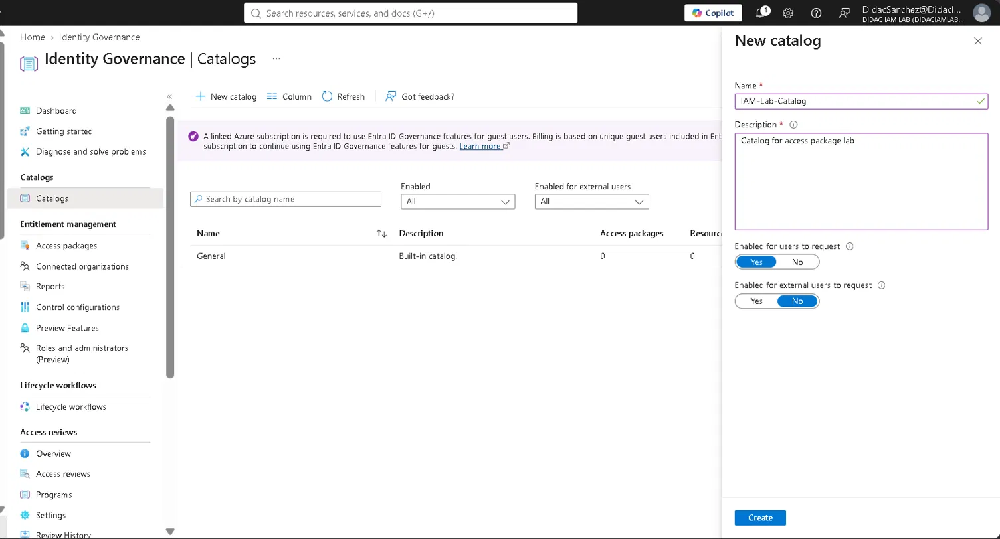

---

### 3. Add resource to catalog

Added `SG-Finance-App-Access` as a resource inside `IAM-Lab-Catalog` from the Resources tab.

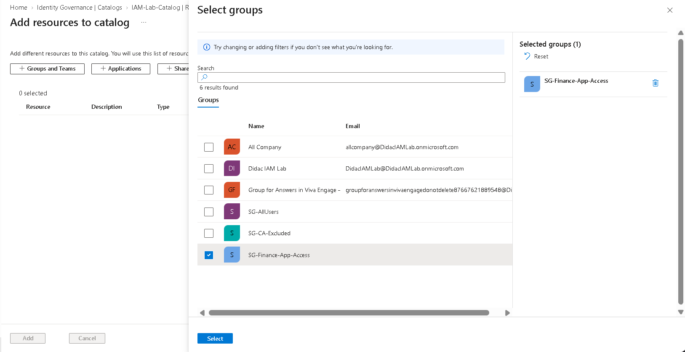

---

### 4. Create access package — basics

Created `AP-Finance-Access` inside `IAM-Lab-Catalog`.

- Name: `AP-Finance-Access`
- Description: `Access to finance application resources`
- Catalog: `IAM-Lab-Catalog`

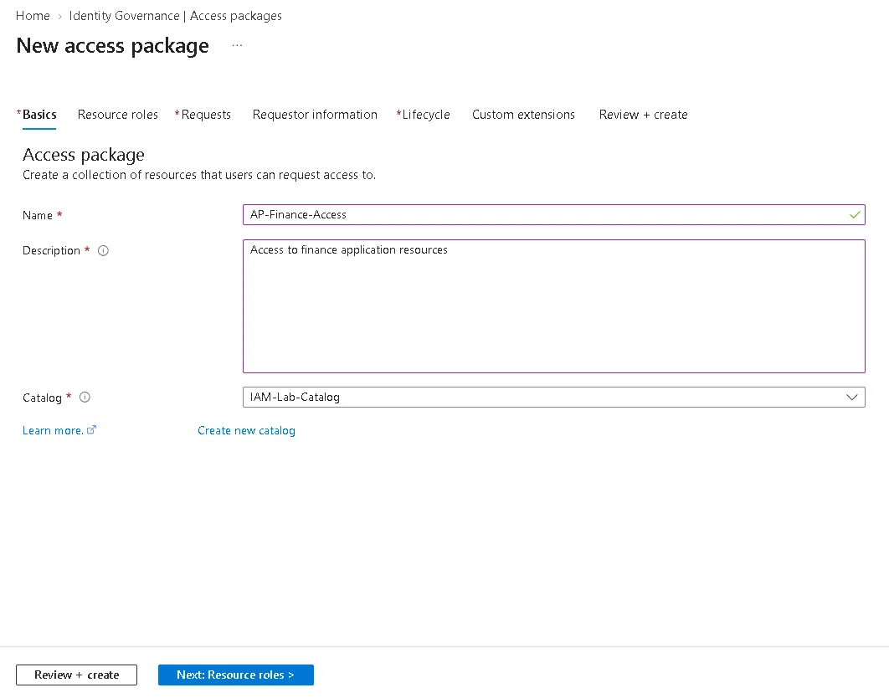

---

### 5. Configure resource roles

Linked `SG-Finance-App-Access` to the access package with role **Member**, so approved users get added to the group automatically.

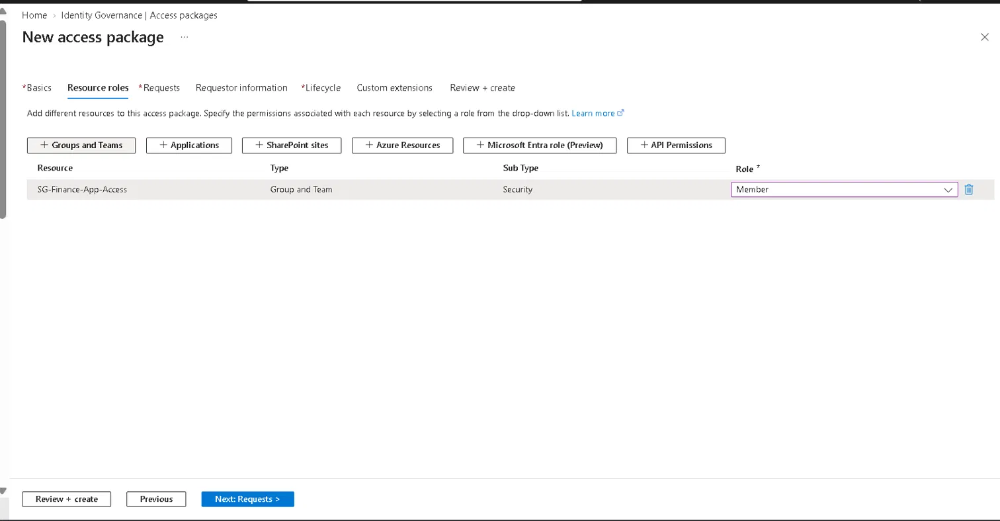

---

### 6. Configure request policy

This is where the governance actually happens. Defined who can request access and how it gets approved:

| Setting | Value |
|---|---|
| Who can request | SG-AllUsers (specific group in directory) |
| Self-service enabled | Yes |
| Require approval | Yes |
| Approval stages | 1 |
| First approver | DidacSanchez |
| Require requestor justification | Yes |
| Require approver justification | Yes |
| Decision deadline | 14 days |

---

### 7. Configure lifecycle

Set automatic expiration so access doesn't become permanent:

| Setting | Value |
|---|---|
| Assignments expire | Number of days |
| Days until expiration | 30 |
| Users can request specific timeline | No |
| Require access reviews | No |
| Allow users to extend access | Yes |
| Require approval to grant extension | Yes |

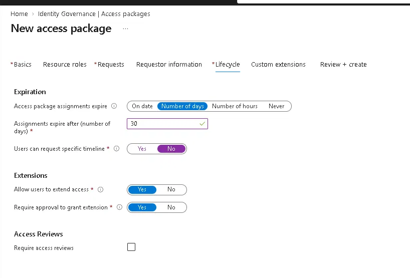

---

### 8. Access package created

`AP-Finance-Access` created successfully inside `IAM-Lab-Catalog`.

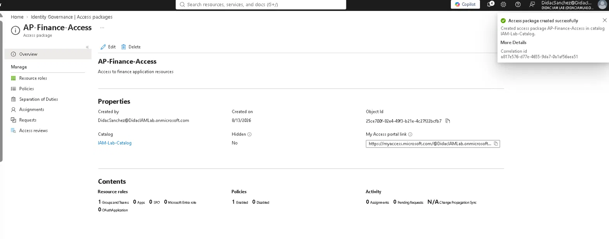

---

### 9. End-user request via myaccess.microsoft.com

Logged in as `testpim` in a private browser session. Went to **myaccess.microsoft.com → Access packages → AP-Finance-Access → Request**.

Business justification submitted: *"Need access to finance resources for Q3 reporting"*

The request went straight into pending approval.

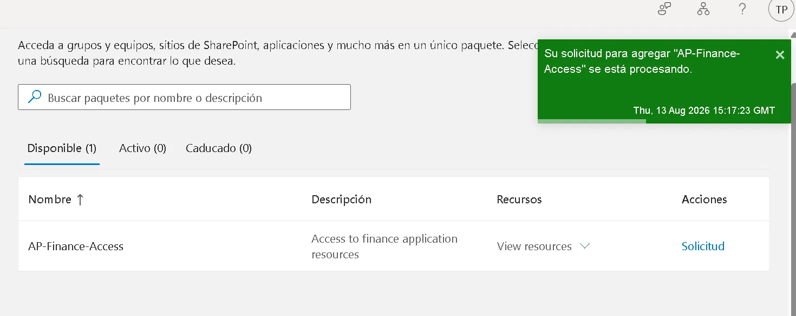

---

### 10. Admin approval

Logged back in as `DidacSanchez` and went to **myaccess.microsoft.com → Approvals → Pending**.

Reviewed the request from Test PIM User, selected **Approve**, and added the justification: *"Approved for Q3 finance project access"*

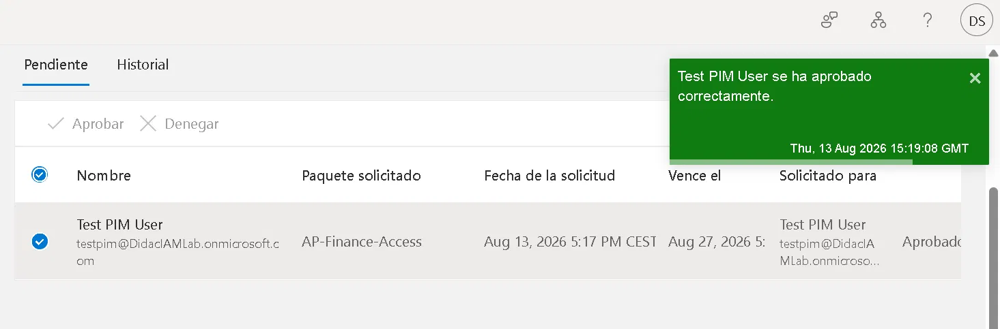

---

### 11. Automatic group provisioning verified

Went to **Groups → SG-Finance-App-Access → Members**.

Test PIM User showed up as a direct member right after the approval, with no manual step from IT.

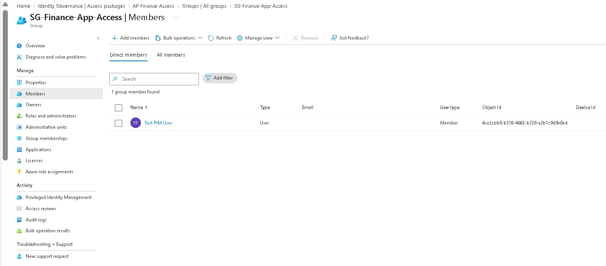

---

### 12. Assignment with expiration date confirmed

Went to **AP-Finance-Access → Assignments**.

The assignment was there with:
- Status: **Delivered**
- End date: **September 12, 2026** (30 days from assignment)
- Access gets revoked on that date without anyone doing anything

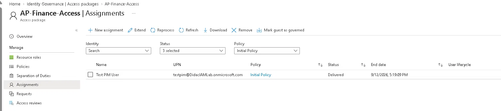

---

## Design Decisions

**Why a dedicated catalog instead of the built-in General catalog?**
Catalogs are the governance boundary in Entitlement Management. Separate catalogs let you delegate ownership and apply different policies per department or application. Using the default General catalog would work for a single lab, but it doesn't reflect how this gets organised once more than one team is involved.

**Why SG-AllUsers as requestable scope instead of All members?**
Scoping to a specific group applies least privilege at the policy level: only users in SG-AllUsers can even see this package. In a real environment this would be scoped to the department that actually needs it, not to everyone in the directory.

**Why 30-day expiration instead of permanent access?**
Permanent access piles up over time and nobody notices. A 30-day window forces revalidation. If the user still needs it, they request an extension, which also goes through approval, so the renewal is recorded too.

**Why require both requestor and approver justification?**
With both sides recorded, an audit can trace not just who approved something but why it was asked for and why it was granted. Without it you end up with approvals nobody actually reviewed.

---

## Lessons Learned

The "Self" checkbox is easy to miss. In the Requests policy there is a "Who can request access" section with separate checkboxes for Self, Admin and Manager. Admin is ticked by default and can't be turned off, so at first glance the section looks configured. But if you don't tick Self, the end user can't request anything, only an admin can assign it directly. I set up the whole policy, went to test it as testpim, and had to go back and fix this.

**Provisioning was much faster than I expected.** I had read that group membership can take up to 15 minutes to appear after approval. In my tenant testpim showed up in the group in a few seconds. Either the docs are conservative or small trial tenants replicate faster, but it's worth knowing that both are normal so you don't start troubleshooting something that isn't broken.

**The My Access link is tenant-specific.** The portal gives you a direct link that includes the tenant name (`myaccess.microsoft.com/@DidacIAMLab.onmicrosoft.com`). That matters for users who belong to more than one directory, because the generic link can drop them in the wrong tenant.

---

## What I'd Do Differently

I only tested the happy path: request, approve, provision. I'd like to have also tested what happens when a request is **denied**, and the extension flow when the 30 days are close to expiring, since I configured extensions to require approval but never triggered one.

I'd also set the decision deadline shorter than 14 days. Two weeks is the maximum the portal allows, but in a real environment a request sitting unanswered for two weeks means the user is blocked from doing their job.

---

## Key Concepts (SC-300 Relevant)

| Concept | Description |
|---|---|
| **Entitlement Management** | Entra ID feature that automates access request, approval and lifecycle for groups, apps and SharePoint sites |
| **Access Package** | A named bundle of resource roles that users can request as one unit |
| **Catalog** | Governance container that groups access packages and their resources, supports delegated management |
| **Policy** | Defines requestable scope, approval workflow and lifecycle for an access package |
| **Auto-provisioning** | Group membership assigned automatically on approval, without IT intervention |
| **Time-bound access** | Access that expires by itself after a set period |
| **myaccess.microsoft.com** | Self-service portal where users request, view and manage their access packages |
| **Separation of duties** | Access packages support SoD rules to block conflicting access combinations |
