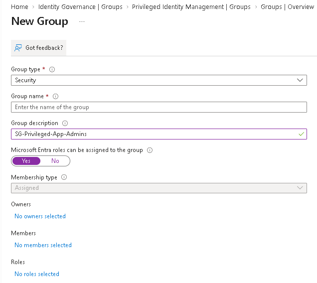
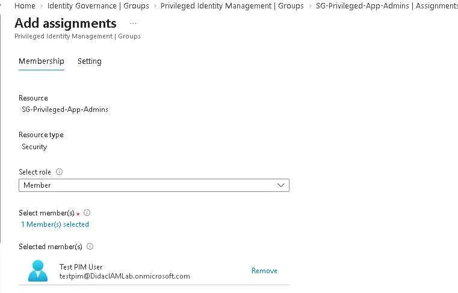
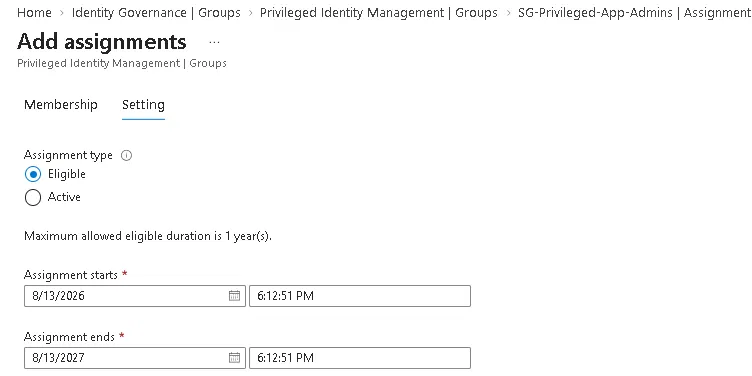
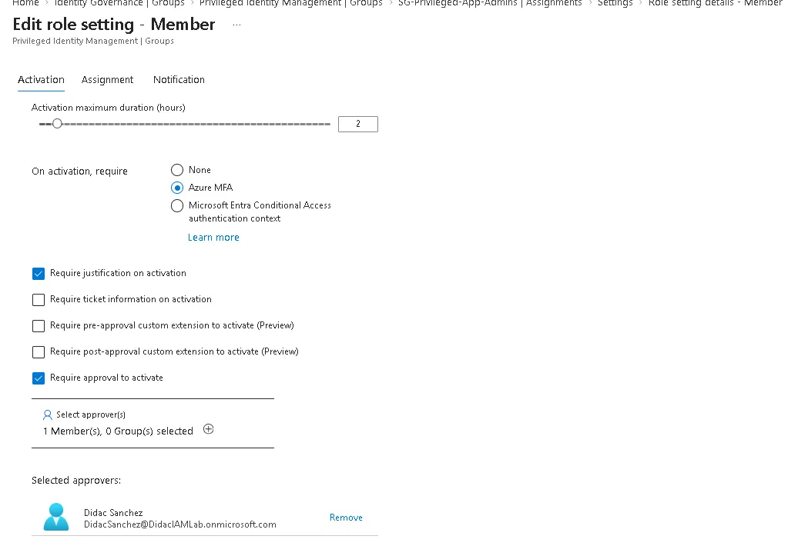
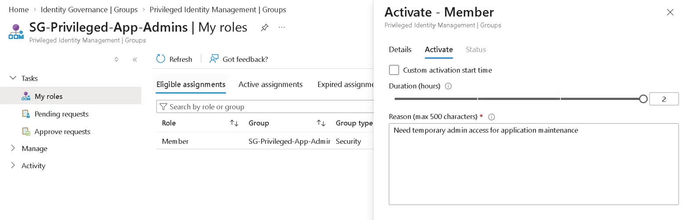
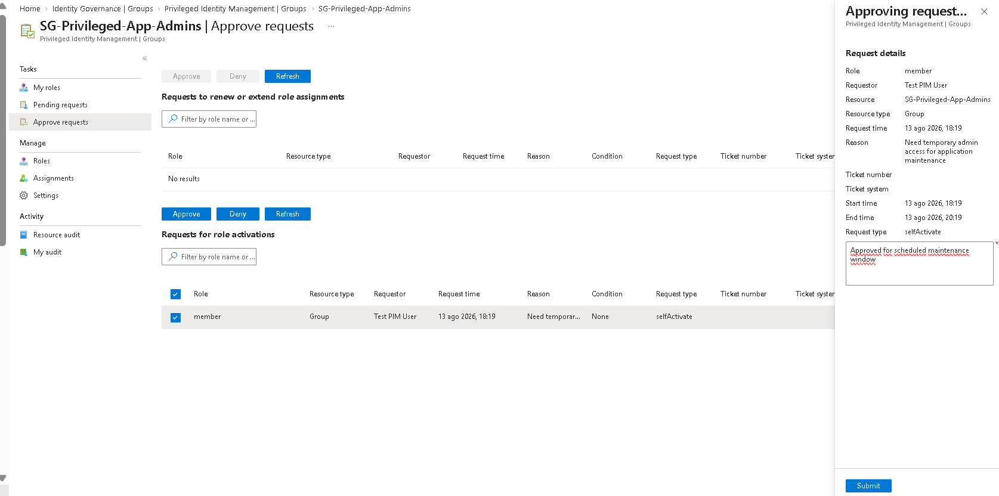
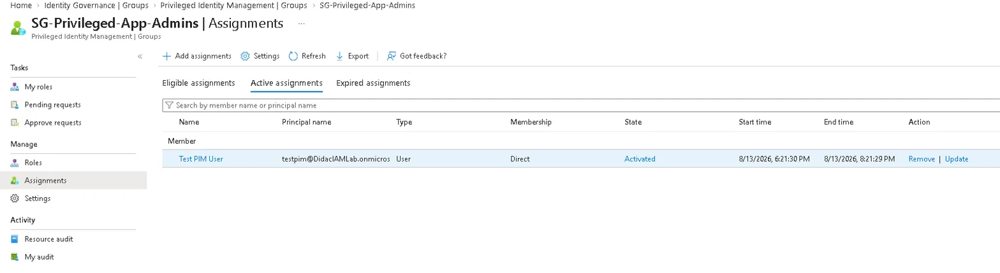
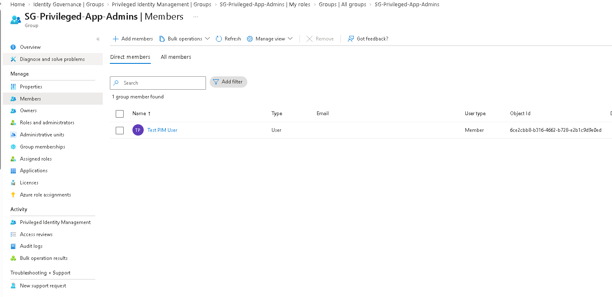
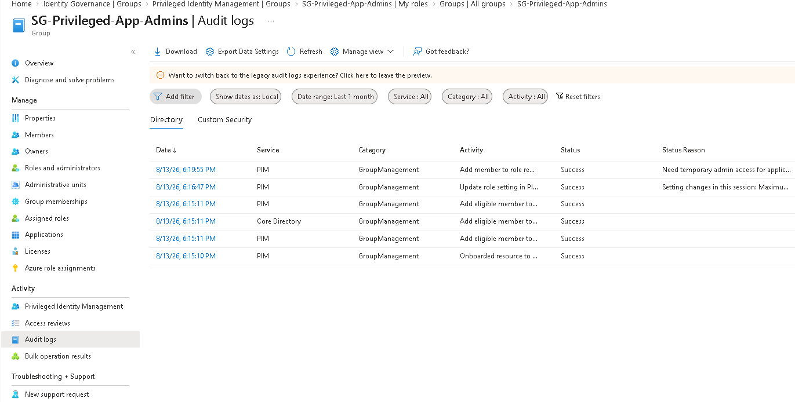

# Lab 07 — PIM for Groups (Just-in-Time Group Membership)

## Objective

Extend Privileged Identity Management beyond Entra ID roles to group membership. Configure a security group so nobody is a permanent member. Instead users hold an *eligible* assignment and activate it on demand for a limited time, with MFA, justification and approval required.

**Zero Trust principle applied:** Least privilege access + Assume breach. Privileged group membership is never standing. It's time-bound, justified, approved and auditable, and when the window closes the user is removed automatically.

---

## Environment

| Component | Value |
|---|---|
| Tenant | DidacIAMLab.onmicrosoft.com |
| License | Microsoft Entra ID P2 (trial) |
| Admin account | DidacSanchez@DidacIAMLab.onmicrosoft.com |
| Test user | testpim@DidacIAMLab.onmicrosoft.com |
| Portal | entra.microsoft.com |

---

## A note on licensing: what I tried first

This lab was originally going to be Lifecycle Workflows (automated joiner/leaver processes). I went to **Identity Governance → Lifecycle workflows** and got a `401 — You don't have access` error.

The reason turned out to be licensing. Lifecycle Workflows is not part of Entra ID P2. It requires the separate **Microsoft Entra ID Governance** SKU, which is an add-on licensed per user on top of P1 or P2.

This is worth knowing because P2 is often described as "the one with all the identity governance features", and it isn't. P2 gives you PIM, Identity Protection, Access Reviews and Entitlement Management. Lifecycle Workflows, on-premises connectors and a few other governance features sit in the separate Governance SKU.

I couldn't add that licence to a trial tenant, so I moved on to PIM for Groups instead. The error is documented here rather than left out, because working out which feature belongs to which SKU is a real part of the job.

---

## What Was Built

| Component | Name | Purpose |
|---|---|---|
| Privileged group | SG-Privileged-App-Admins | Role-assignable security group managed by PIM |
| Eligible assignment | Member (testpim) | Just-in-time membership, not permanently active |
| PIM role settings | Member settings | Controls activation duration, MFA, justification and approval |
| Approver | DidacSanchez | Reviews and approves activation requests |

---

## Steps

### 1. Create role-assignable security group

Created `SG-Privileged-App-Admins` with **Microsoft Entra roles can be assigned to the group: Yes**.

This setting is mandatory. Without it PIM can't manage the group's membership, and it can't be changed after the group is created.

---

### 2. Onboard group into PIM

Went to **Identity Governance → Privileged Identity Management → Groups** and selected `SG-Privileged-App-Admins`.

The group was onboarded into PIM automatically. The Eligible / Active / Expired assignment tabs became available straight away, and the audit log recorded an "Onboarded resource to PIM" event at that moment.

---

### 3. Create eligible assignment

From **Assignments → + Add assignments**:

| Setting | Value |
|---|---|
| Select role | Member |
| Select members | Test PIM User |
| Assignment type | Eligible |
| Duration | 1 year (8/13/2026 → 8/13/2027) |

Eligible means the user can *request* activation. They are not a member of the group until they do it and get approved.

---

### 4. Configure PIM role settings

Edited the **Member** role settings so every activation has to pass the same controls:

| Setting | Value |
|---|---|
| Activation maximum duration | 2 hours |
| On activation, require | Azure MFA |
| Require justification on activation | Yes |
| Require approval to activate | Yes |
| Approver | DidacSanchez |

---

### 5. Activation request from testpim

Logged in as `testpim` in a private browser session. Went to **PIM → My roles → Groups** → `SG-Privileged-App-Admins` → **Activate**.

- Duration: **2 hours**
- Reason: `Need temporary admin access for application maintenance`

The request went to pending approval after MFA verification.

---

### 6. Admin approval

Logged in as `DidacSanchez` and went to **PIM → Groups → SG-Privileged-App-Admins → Approve requests**.

Reviewed the pending request and approved it with the justification `Approved for scheduled maintenance window`. The approval panel shows the full request context: role, requestor, resource, start and end time, and the reason given.

---

### 7. Active time-bound membership verified in PIM

Went to **SG-Privileged-App-Admins → Assignments → Active assignments**.

| Field | Value |
|---|---|
| Name | Test PIM User |
| State | Activated |
| Membership | Direct |
| Start time | 8/13/2026, 6:21:30 PM |
| End time | 8/13/2026, 8:21:29 PM |

The membership gets removed at 8:21 PM with no manual action.

---

### 8. Group membership verified

Went to **Groups → SG-Privileged-App-Admins → Members**.

Test PIM User appears as a direct member during the active window, which confirms PIM turns the approved activation into real group membership rather than just recording it somewhere.

---

### 9. Audit trail

Went to **SG-Privileged-App-Admins → Activity → Audit logs**.

The full chain of events recorded by PIM:

| Time | Service | Activity | Status |
|---|---|---|---|
| 6:15:10 PM | PIM | Onboarded resource to PIM | Success |
| 6:15:11 PM | PIM | Add eligible member to role | Success |
| 6:15:11 PM | Core Directory | Add eligible member to role | Success |
| 6:16:47 PM | PIM | Update role setting in PIM | Success |
| 6:19:55 PM | PIM | Add member to role (activation) | Success |

The justification (`Need temporary admin access for application maintenance`) is stored in the audit log as the status reason, so the whole request is traceable after the fact.

---

## Design Decisions

**Why a role-assignable group instead of a regular security group?**
PIM can only manage groups created with "Microsoft Entra roles can be assigned to the group" enabled, and that setting can't be added later. Role-assignable groups are what you use to grant access to sensitive resources or Entra roles indirectly, so putting PIM governance on them is the point.

**Why require approval as well as MFA?**
MFA proves the requestor is who they claim to be. Approval proves someone else agreed with the business reason. They cover different problems: MFA covers a stolen credential, approval covers misuse or a mistake by a legitimate user. In a real environment the approver would be a team lead or security officer, not the same person who set up the group.

**Why 2 hours instead of longer?**
The window should match the task. If the session gets compromised during an active window, two hours limits how long the attacker has group membership before it expires on its own.

**Why PIM for groups instead of direct assignment?**
Direct permanent membership exists 24/7 whether it's needed or not. PIM for groups turns that into just-in-time access, which is what makes least privilege workable at scale. In production this pattern gets used for privileged app roles, SharePoint sites, and Entra roles assigned through groups.

---

## Lessons Learned

**"The resource is invalid" is cosmetic.** The first time I opened the group in PIM I got a red error banner with a resource GUID. Nothing was actually broken. Assignments, settings and approvals all worked normally. I had seen the same kind of thing in Lab 02, where PIM showed "Activate role failed — Unknown error" but the request had gone through fine. It's a display bug in the Entra admin center, not a config problem, but the first time you see it you assume you did something wrong.

Role-assignable groups lock the membership type. When you set "Entra roles can be assigned" to Yes, the Membership type field greys out at Assigned and you can't pick Dynamic. That makes sense once you think about it: dynamic membership rules would fight with PIM over who controls the group, so Microsoft doesn't let you combine them.

**The audit log records the same event twice.** Adding the eligible member appears once under PIM and once under Core Directory, one second apart. That confused me at first. PIM orchestrates the operation and Core Directory writes the actual directory change, so both services log it. For an investigation that's useful, because you get the intent and the result separately.

---

## Key Concepts (SC-300 Relevant)

| Concept | Description |
|---|---|
| **PIM for Groups** | Extends PIM beyond Entra roles to manage group membership with JIT controls |
| **Eligible assignment** | User can request activation but is not a member until approved |
| **Active assignment** | User is currently a member, removed automatically when the window expires |
| **Role-assignable group** | Security group that can hold Entra role assignments, required for PIM management |
| **Just-in-time (JIT) access** | Access granted only when needed, for the minimum time required |
| **Standing privilege** | Permanent access that exists regardless of need, which is what PIM removes |
| **Activation window** | Maximum time a user can stay active in the group per request |
| **Entra ID Governance SKU** | Separate add-on licence covering Lifecycle Workflows and other governance features not included in P2 |
