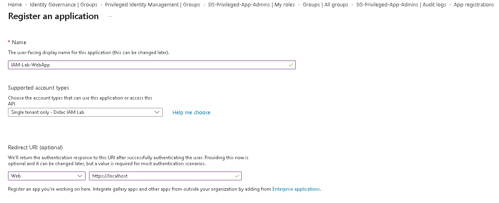
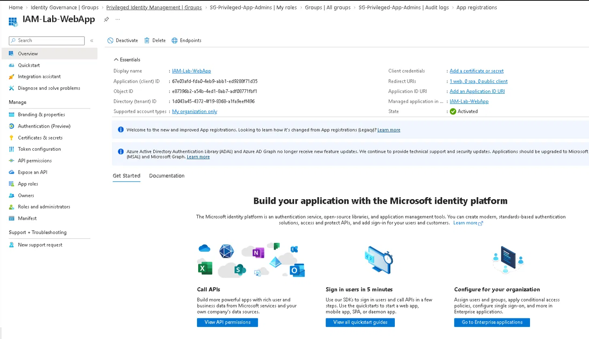
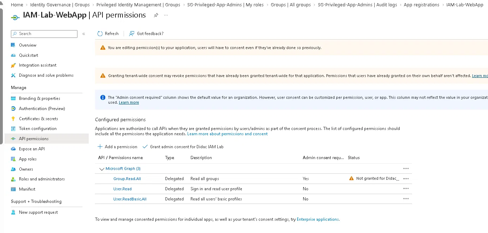
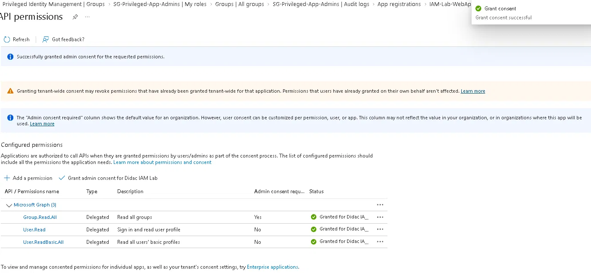
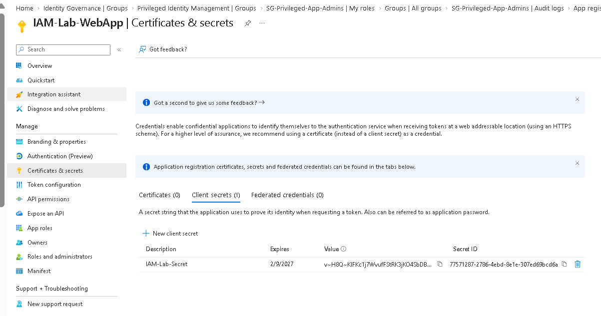
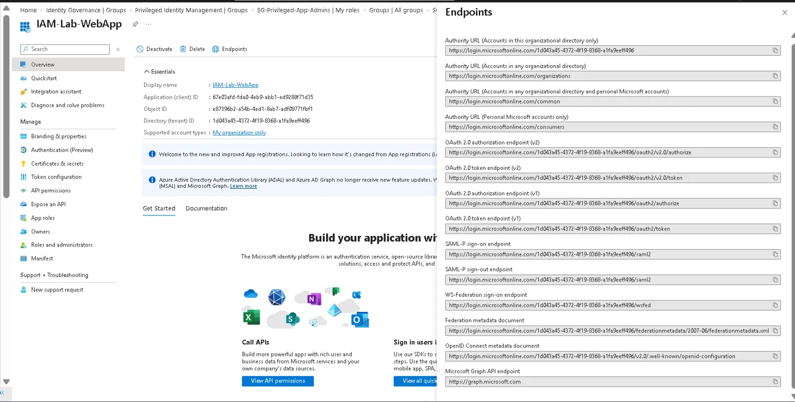

# Lab 08 — App Registration + OAuth2/OIDC

## Objective

Register an application in Microsoft Entra ID, configure delegated API permissions with admin consent, create a client secret, and work through the OAuth2/OIDC authentication endpoints. Understand the difference between delegated and application permissions, and how the authorization code flow works behind any "Sign in with Microsoft" button.

**Zero Trust principle applied:** Verify explicitly. Every application that touches resources has to be registered, granted only the permissions it needs, and authenticated with a credential that can be verified. Nothing gets implicit trust just because it's inside the tenant.

---

## Environment

| Component | Value |
|---|---|
| Tenant | DidacIAMLab.onmicrosoft.com |
| Tenant ID | 1d043a45-4372-4f19-8368-a1fa9eeff496 |
| License | Microsoft Entra ID P2 (trial) |
| Admin account | DidacSanchez@DidacIAMLab.onmicrosoft.com |
| Portal | entra.microsoft.com |

---

## What Was Built

| Component | Name/Value | Purpose |
|---|---|---|
| App registration | IAM-Lab-WebApp | Represents a web application registered in Entra ID |
| Client ID | 67e03afd-fda0-4eb9-abb1-ed9288f71d35 | Unique identifier of the app in the tenant |
| Redirect URI | https://localhost | Where Entra ID sends the auth code after login |
| Delegated permissions | User.Read, User.ReadBasic.All, Group.Read.All | Scopes the app can request on behalf of a signed-in user |
| Client secret | IAM-Lab-Secret (180-day expiry) | App credential used to authenticate at the token endpoint |

---

## Steps

### 1. Register the application

Went to **App registrations → + New registration** and configured:

| Setting | Value |
|---|---|
| Name | IAM-Lab-WebApp |
| Supported account types | Single tenant — Didac IAM Lab only |
| Redirect URI | Web → https://localhost |

Single tenant means only users from `DidacIAMLab.onmicrosoft.com` can authenticate. The redirect URI is where Entra ID sends the authorization code after a successful login, and in a real app it would be an HTTPS endpoint you actually control.



---

### 2. Review app identifiers

After registration the Overview page shows the three identifiers used in every OAuth2/OIDC flow:

| Identifier | Value | Used for |
|---|---|---|
| Application (client) ID | 67e03afd-fda0-4eb9-abb1-ed9288f71d35 | Identifies the app to Entra ID |
| Directory (tenant) ID | 1d043a45-4372-4f19-8368-a1fa9eeff496 | Identifies which tenant to authenticate against |
| Object ID | e87396b2-a54b-4ed1-8ab7-adf08771fbf1 | Internal Entra ID object reference |



---

### 3. Configure delegated API permissions

Went to **API permissions → + Add a permission → Microsoft Graph → Delegated permissions** and added:

| Permission | Type | Admin consent required | Description |
|---|---|---|---|
| User.Read | Delegated | No | Sign in and read the signed-in user's profile |
| User.ReadBasic.All | Delegated | No | Read basic profile of all users in the directory |
| Group.Read.All | Delegated | Yes | Read all groups in the directory |

**Delegated vs Application permissions:**
- **Delegated** means the app acts on behalf of a signed-in user, and the user's own permissions act as a ceiling. If the user can't read a group, the app can't read it for them either.
- **Application** means the app acts as itself with no user context. That's what daemons and background services use. It's more powerful and needs stricter control, because there's no user permission ceiling limiting what it can reach.



---

### 4. Grant admin consent

`Group.Read.All` requires admin consent because reading every group in the directory is a tenant-wide operation that an individual user can't authorise on their own.

Clicked **Grant admin consent for Didac IAM Lab** and confirmed. All three permissions then showed "Granted for Didac IA..." with a green tick.

Without this, any user signing in through the app would get a consent prompt for Group.Read.All, and if user consent is blocked by tenant policy the login fails outright.



---

### 5. Create client secret

Went to **Certificates & secrets → Client secrets → + New client secret**:

| Setting | Value |
|---|---|
| Description | IAM-Lab-Secret |
| Expires | 180 days |

The value is only shown once, right after creation. Navigate away and it's gone for good, leaving only the Secret ID visible.

> **Secret value and Secret ID redacted in the screenshot below.** Credentials don't belong in a public repository, even expired ones. The app was decommissioned when the tenant dropped back to Entra ID Free.



**Certificate vs secret:**
Certificates are what you'd use in production. They're asymmetric, so the private key never leaves the app server. Secrets are symmetric, which means anyone who gets a copy has full app access until it's rotated. Secrets are simpler to set up, which is exactly why they end up committed to repos and leaked.

---

### 6. OAuth2/OIDC endpoints

Clicked **Endpoints** in the Overview toolbar. The panel lists every authentication endpoint available for this tenant:

| Endpoint | URL pattern | Purpose |
|---|---|---|
| OAuth 2.0 authorization (v2) | .../oauth2/v2.0/authorize | Step 1: user logs in and consents, gets auth code |
| OAuth 2.0 token (v2) | .../oauth2/v2.0/token | Step 2: app exchanges auth code for tokens |
| OpenID Connect metadata | .../.well-known/openid-configuration | Discovery document listing endpoints and signing keys |
| SAML-P sign-on | .../saml2 | Legacy SAML federation endpoint |
| Microsoft Graph API | https://graph.microsoft.com | Resource endpoint the access token is sent to |

Every endpoint is tenant-scoped. They all include the Tenant ID in the URL, which is what keeps authentication limited to users of this directory.



---

## OAuth2 Authorization Code Flow

This is the flow behind every "Sign in with Microsoft" button. Documented here as reference for the configuration above rather than executed end to end in this lab, since there is no real application behind `https://localhost`.

```
1. User clicks "Sign in with Microsoft" in the app
2. App redirects user to:
   https://login.microsoftonline.com/{tenant}/oauth2/v2.0/authorize
   ?client_id=67e03afd-...
   &response_type=code
   &redirect_uri=https://localhost
   &scope=User.Read Group.Read.All

3. User authenticates (MFA if a CA policy requires it)
4. Entra ID sends an authorization code back to redirect_uri

5. App exchanges the code for tokens at:
   POST https://login.microsoftonline.com/{tenant}/oauth2/v2.0/token
   Body: code=..., client_id=..., client_secret=..., redirect_uri=...

6. Entra ID returns:
   - access_token   (sent to Graph API to authorise the call)
   - id_token       (JWT containing the user's identity claims)
   - refresh_token  (used to get new access tokens without re-login)

7. App calls Microsoft Graph with the access token:
   GET https://graph.microsoft.com/v1.0/me
   Authorization: Bearer {access_token}
```

The reason the code gets exchanged for tokens in a separate back-channel call, rather than the token coming straight back in the redirect, is that the redirect goes through the user's browser where it can be intercepted. The code on its own is useless without the client secret.

---

## Design Decisions

**Why single tenant instead of multi-tenant?**
Single tenant limits authentication to `DidacIAMLab.onmicrosoft.com`. Multi-tenant would let users from any Entra directory sign in, which is what SaaS products need but brings guest policies and cross-tenant access settings into scope. For a lab there's no reason to open that up.

**Why a client secret instead of a certificate?**
Secrets are faster to create and don't need certificate infrastructure, which suits a lab. For anything real, certificates are the right answer for the reasons in step 5.

**Why grant admin consent at tenant level instead of per user?**
Per-user consent for `Group.Read.All` would fail in most corporate tenants, because admin consent requirements block it by policy. Tenant-wide consent means users never see a consent dialog at all, which is the normal pattern for internal apps.

**Why https://localhost as the redirect URI?**
There's no web server behind this app, so localhost is a safe placeholder. Entra ID validates the redirect URI against the registered list before sending the code, which is what stops an attacker redirecting the auth code to a URL they control.

---

## Lessons Learned

The client secret value really is shown only once. I knew this in theory but it's different when you see it happen. After navigating away from the page the Value column shows a truncated string and there is no way to reveal it again. If you lose it you delete the secret and create a new one. This is the whole reason production apps write the secret straight into Key Vault at creation time instead of copying it somewhere "temporarily".

**Adding a permission is not the same as granting it.** The API permissions list is a declaration of what the app *may* ask for. Until consent is granted, the app gets an error at runtime even though the permission is sitting right there in the portal looking configured. `Group.Read.All` showed "Not granted for Didac..." with a warning icon and I nearly missed it.

**v1 and v2 endpoints both show up in the panel.** v2 supports work, school and personal Microsoft accounts, uses scopes rather than resource URIs, and allows incremental consent. v1 is ADAL-based and in maintenance mode. Microsoft has deprecated ADAL, so new apps should be on v2, but the v1 endpoints are still listed which makes it easy to copy the wrong one.

---

## Key Concepts (SC-300 Relevant)

| Concept | Description |
|---|---|
| **App registration** | The configuration object defining an application's identity in Entra ID |
| **Service principal** | The runtime instance of an app registration in a specific tenant, created automatically |
| **Client ID** | The app's unique identifier, sent in every auth request |
| **Redirect URI** | Where Entra ID sends the auth code, validated against the registered list to prevent hijacking |
| **Delegated permission** | Access on behalf of a signed-in user, bounded by that user's own permissions |
| **Application permission** | Access granted to the app itself with no user context, requires admin consent |
| **Admin consent** | Tenant-wide permission grant that removes per-user consent prompts |
| **Client secret** | Password-like credential the app uses to prove its identity at the token endpoint |
| **Access token** | Short-lived JWT (usually 1 hour) presented to APIs as proof of authorisation |
| **Authorization code flow** | Standard OAuth2 flow for web apps: login, get code, exchange code for tokens |
| **OpenID Connect (OIDC)** | OAuth2 extension adding identity via an id_token with user claims |
