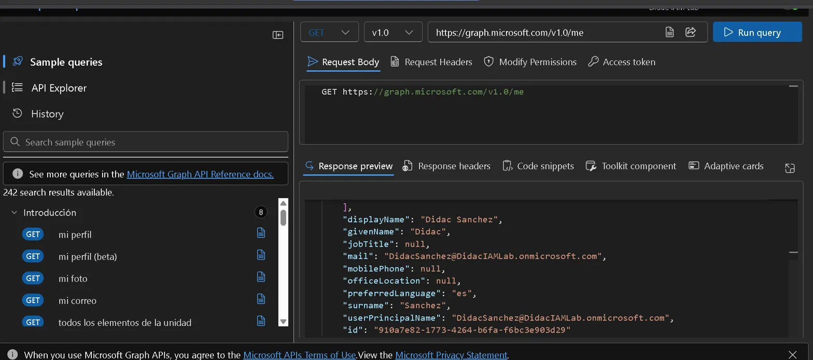
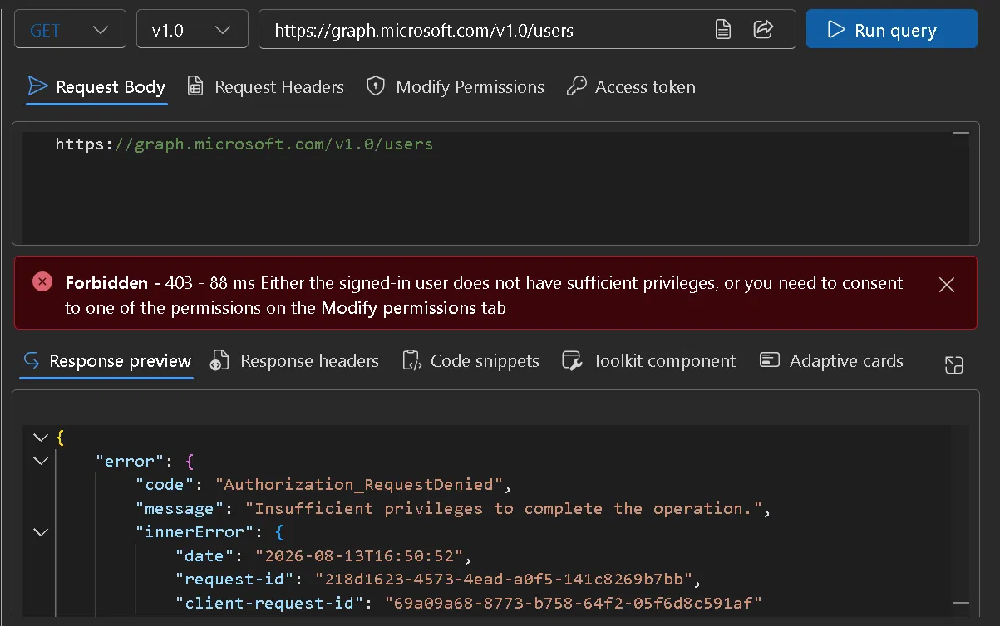
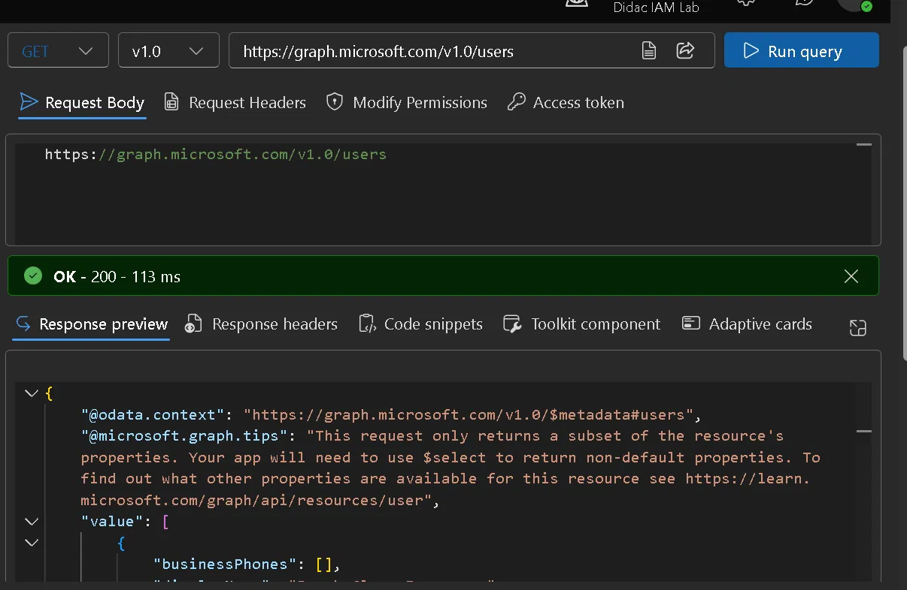
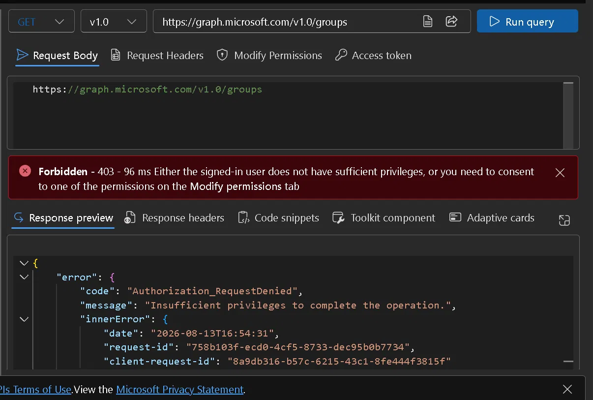
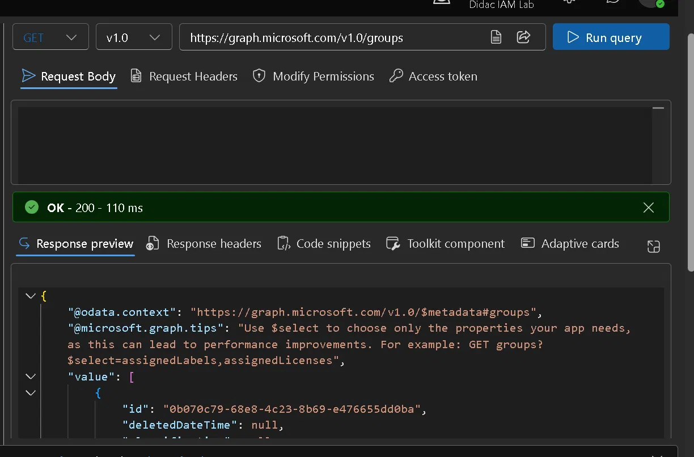
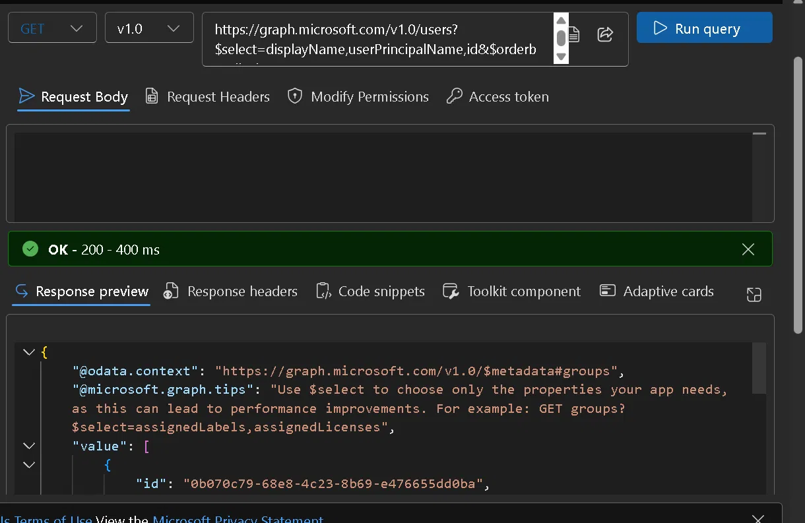
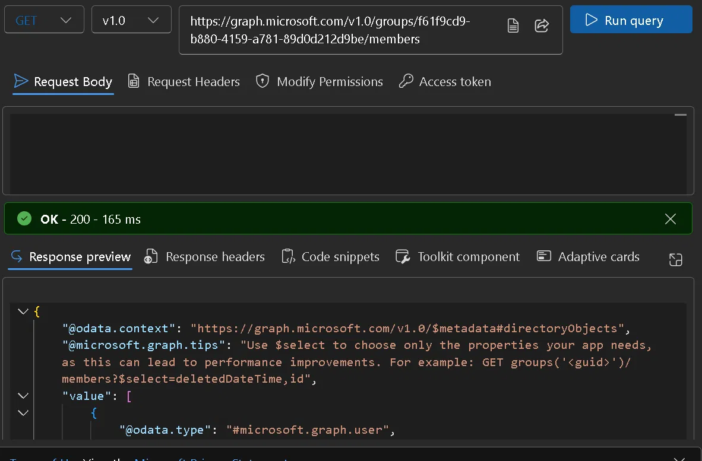

# Lab 09 — Microsoft Graph API (Graph Explorer)

## Objective

Query Microsoft Entra ID programmatically through the Microsoft Graph API. Retrieve users, groups and group membership using REST calls and OData parameters instead of clicking through the portal, and understand how permission scopes and consent control what the API will return.

**Zero Trust principle applied:** Verify explicitly. Every API call has to carry a valid token and consented scopes. Being a Global Admin in the tenant doesn't grant access to the data by itself.

---

## Environment

| Component | Value |
|---|---|
| Tenant | DidacIAMLab.onmicrosoft.com |
| License | Microsoft Entra ID P2 (trial) |
| Admin account | DidacSanchez@DidacIAMLab.onmicrosoft.com |
| Tool | Microsoft Graph Explorer — developer.microsoft.com/graph/graph-explorer |
| API version | v1.0 |

**On the tooling:** I originally planned to do this with PowerShell and the `Microsoft.Graph` module. `Install-Module` is blocked on my work laptop, and Azure Cloud Shell turned out to need a linked Azure subscription which this tenant doesn't have. Graph Explorer solved it: it's the same REST API, the same tokens and the same responses, just a different client. The PowerShell equivalents are included at the end for reference.

---

## Queries Executed

| # | Method | Endpoint | Result |
|---|---|---|---|
| 1 | GET | /v1.0/me | Admin profile JSON |
| 2 | GET | /v1.0/users | All 3 tenant users |
| 3 | GET | /v1.0/groups | All 7 tenant groups |
| 4 | GET | /v1.0/users?$select=...&$orderby=... | Filtered and sorted user list |
| 5 | GET | /v1.0/groups/{id}/members | Members of SG-Finance-App-Access |

---

## Steps

### 1. Get signed-in user profile — GET /me

```http
GET https://graph.microsoft.com/v1.0/me
```

Returned the profile of the currently authenticated account with the standard user properties: `displayName`, `userPrincipalName`, `mail`, `id`, `preferredLanguage`.



---

### 2. List all users — GET /users

```http
GET https://graph.microsoft.com/v1.0/users
```

**403 Forbidden on the first attempt.** The call returned `Authorization_RequestDenied` because Graph Explorer didn't have `User.ReadBasic.All` consented.

Fixed it from the **Modify permissions** tab: found `User.ReadBasic.All`, clicked **Consent**, accepted the prompt, and re-ran the query.



After consent the query returned all 3 tenant users:

| User | UPN | Object ID |
|---|---|---|
| Break Glass Emergency | breakglass@DidacIAMLab.onmicrosoft.com | 2c76d6c6-17c9-46dc-b1a1-a79834286bd8 |
| Didac Sanchez | DidacSanchez@DidacIAMLab.onmicrosoft.com | 910a7e82-1773-4264-b6fa-f6bc3e903d29 |
| Test PIM User | testpim@DidacIAMLab.onmicrosoft.com | 6ce2cbb8-b316-4662-b728-e2b1c9d9e0ed |



---

### 3. List all groups — GET /groups

```http
GET https://graph.microsoft.com/v1.0/groups
```

**403 again, same pattern.** `Group.Read.All` needed its own consent in Graph Explorer, even though I had already granted that exact scope tenant-wide on the `IAM-Lab-WebApp` registration back in Lab 08. Graph Explorer is a different application with its own permission grants.

Fixed the same way: **Modify permissions → Group.Read.All → Consent**.



The query then returned all 7 tenant groups:

| Group | Type | Purpose |
|---|---|---|
| SG-Privileged-App-Admins | Security (role-assignable) | PIM for groups — Lab 07 |
| Didac IAM Lab | Microsoft 365 | Default tenant group |
| All Company | Microsoft 365 | Default Viva Engage group |
| SG-AllUsers | Security | Standard users subject to CA policies |
| Group for Answers in Viva Engage | Microsoft 365 | Viva Engage system group |
| SG-CA-Excluded | Security | Break-glass exclusion from CA policies |
| SG-Finance-App-Access | Security | Access Package resource — Lab 06 |



---

### 4. Filtered query with OData parameters

```http
GET https://graph.microsoft.com/v1.0/users?$select=displayName,userPrincipalName,id&$orderby=displayName
```

- `$select` limits which properties come back, which cuts the payload down
- `$orderby` sorts the results server-side

This is how you'd write it in a script. Returning full objects when you only need three fields wastes bandwidth and hits throttling limits faster.



---

### 5. Get group members by Object ID

```http
GET https://graph.microsoft.com/v1.0/groups/f61f9cd9-b880-4159-a781-89d0d212d9be/members
```

Took the Object ID of `SG-Finance-App-Access` from the /groups response in step 3 and used it to query the group's members.

The response confirmed **Test PIM User** as a member. That's the same membership the Access Package provisioned automatically in Lab 06, now visible through the API instead of the portal.

Full circle: access requested through myaccess, approved, provisioned automatically, and verifiable programmatically.



---

## PowerShell Equivalents (reference — not executed in this lab)

These are the commands I'd use for the same queries with the `Microsoft.Graph` module, connected via `Connect-MgGraph -Scopes "User.Read.All","Group.Read.All"`. Included as reference since the module install was blocked on my machine.

```powershell
# 1. Current session context
Get-MgContext

# 2. List all users
Get-MgUser -All | Select-Object DisplayName, UserPrincipalName, Id

# 3. List all groups
Get-MgGroup -All | Select-Object DisplayName, SecurityEnabled, Id

# 4. Filtered query with specific properties, sorted
Get-MgUser -All -Property DisplayName, UserPrincipalName, Id |
    Select-Object DisplayName, UserPrincipalName, Id |
    Sort-Object DisplayName

# 5. Members of a specific group
Get-MgGroupMember -GroupId "f61f9cd9-b880-4159-a781-89d0d212d9be" |
    ForEach-Object {
        Get-MgUser -UserId $_.Id | Select-Object DisplayName, UserPrincipalName
    }
```

---

## Design Decisions

**Why v1.0 instead of beta?**
v1.0 only contains GA features and comes with a backwards compatibility guarantee. The beta endpoint has more features but breaking changes can land without notice. For anything you'd script against, v1.0 is the right default unless the feature you need only exists in beta.

**Why query group members by Object ID instead of displayName?**
Object IDs never change. Display names get edited. A script that looks up a group by name breaks silently the day someone renames it, and it's a hard failure to trace.

**Why document the 403 errors instead of just showing working queries?**
The consent model is the part of Graph that catches people out. It's easy to assume Global Admin means access to everything, and it doesn't. Showing the error and the fix is more useful than showing five green 200s.

---

## Lessons Learned

**Tenant-wide admin consent doesn't carry across applications.** I'd granted `Group.Read.All` on `IAM-Lab-WebApp` in Lab 08, so when Graph Explorer threw a 403 on the same scope I assumed something had gone wrong. It hadn't. Each app registration holds its own permission grants, and Graph Explorer is just another registered app in the tenant. Once that clicked it made complete sense, but it wasn't obvious in the moment.

I also lost a couple of minutes on something much dumber: I pasted `GET https://graph.microsoft.com/v1.0/groups` into the URL field including the word GET, and got "Failed to construct URL: Invalid URL". The method goes in the dropdown, not the URL.

**Chaining IDs between calls is the basic pattern.** The `/groups` response gave me the Object ID for `SG-Finance-App-Access`, which went straight into the next call to list its members. Almost everything you do with Graph works this way: get a collection, pull the ID you need, use it in the next request. Once you see it, scripting against Graph stops looking complicated.

**Seeing Lab 06's result through the API changed how I understood it.** The membership I'd watched appear in the portal after the access package approval was just a row of JSON here. Same object, same directory, different lens. It made the relationship between the governance layer and the directory itself much more concrete than reading about it did.

---

## What I'd Do Differently

I'd set the `Microsoft.Graph` module up on my personal machine and re-run all five queries in PowerShell, then compare the output. Graph Explorer is fine for learning the API, but real IAM automation is scripted, scheduled and version-controlled, and I want the reps writing it rather than clicking it.

I'd also try `$filter` properly. I used `$select` and `$orderby`, but `$filter` is where most of the useful work happens (finding accounts that haven't signed in, users missing MFA registration, guests older than X days) and I didn't touch it.

---

## Key Concepts (SC-300 Relevant)

| Concept | Description |
|---|---|
| **Microsoft Graph API** | Unified REST API for Microsoft 365 and Entra ID data: users, groups, devices, mail, calendar |
| **Graph Explorer** | Browser-based tool for testing Graph queries against your own tenant |
| **Permission scope** | Named permission granting access to a specific resource, e.g. `Group.Read.All` |
| **Delegated permission** | API access on behalf of a signed-in user, bounded by that user's permissions |
| **Consent** | A user or admin explicitly granting an app access to specific scopes |
| **OData $select** | Returns only the properties you ask for |
| **OData $filter** | Filters results server-side, e.g. `$filter=displayName eq 'Test PIM User'` |
| **OData $orderby** | Sorts results, e.g. `$orderby=displayName asc` |
| **Object ID** | Immutable GUID identifying an Entra ID object, what scripts should always reference |
| **Bearer token** | Access token sent as `Authorization: Bearer {token}` on every Graph request |
| **v1.0 vs beta** | v1.0 is GA with compatibility guarantees, beta is preview and can break without notice |
